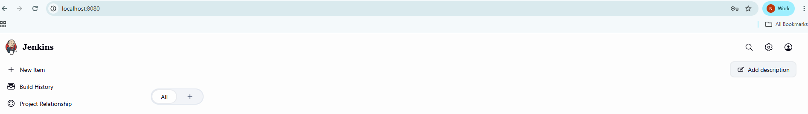
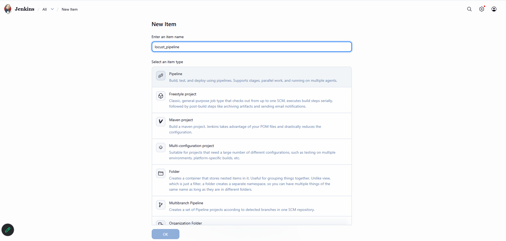
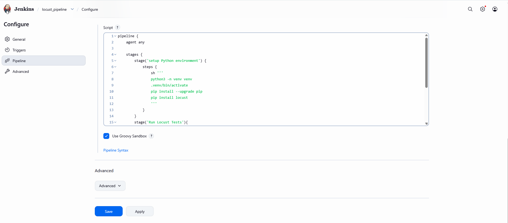
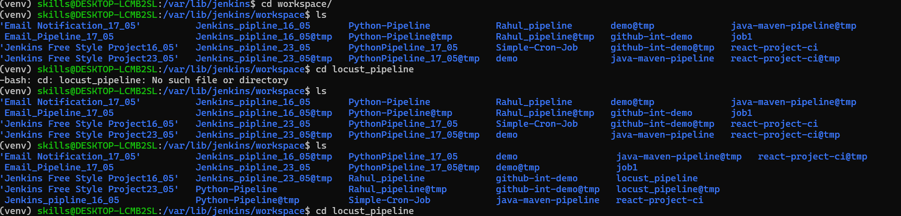
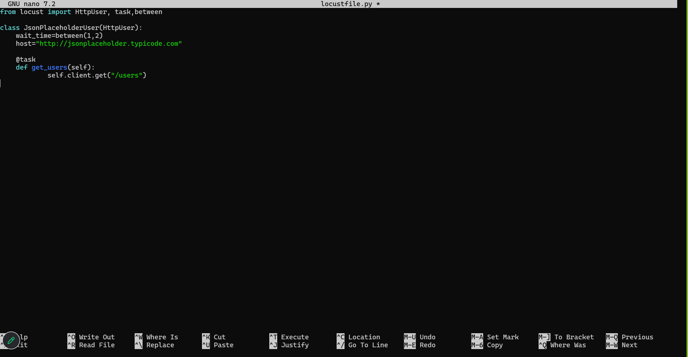
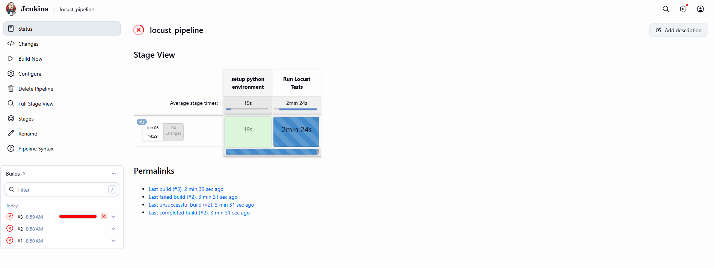

# Locust With Jenkins
## 1. Locust Installation
```
sudo apt update
```
```
sudo apt install python3-venv python3-full -y
```
```
python3 –m venv venv
```
```
source venv/bin/activate
```


```
pip install locust
```
## 2. Start Jenkins
```
sudo systemctl start jenkins
```
- Goto> Browser>localhost:8080 +enter



- Create New Pipeline


- write the pipeline

- pipeline script
```
pipeline {
    agent any
    stages{
        stage('setup python environment'){
            steps{
                sh '''
                    python3 -m venv venv
                    . venv/bin/activate
                    pip install --upgrade pip
                    pip install locust
                '''
            }
        }
        stage('Run Locust Tests'){
            steps{
                sh '''
                    . venv/bin/activate
                    locust -f locustfile.py
                    
                '''
            }
        }
    }
}

```

- now move to this location from linux
```
/var/lib/jenkins/workspace/
```
- search for your project name
```
ls
```
- Note :
```
if your project is not showing in the list run the project once (Build Will Fail!), Not to Worry About.
Retry Again with your project name
```
```
ls
```
```
cd your_project_name
```
```
/var/lib/jenkins/workspace/locust_pipeline
```



- now create locustfile.py
```
sudo nano locustfile.py
```


- ctr+s (save) | ctr+o (write) |ctr +x (exit)
- Open Jenkins and Build The pipeline
 

- Open the Browser and check the result
 
