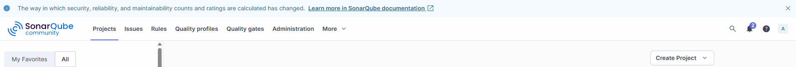
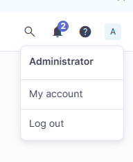
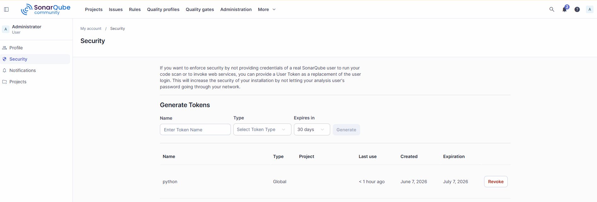
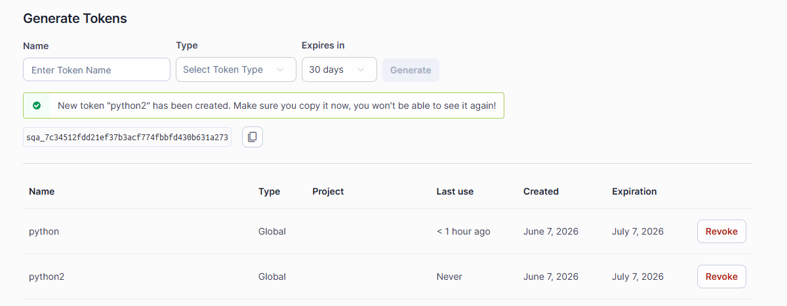
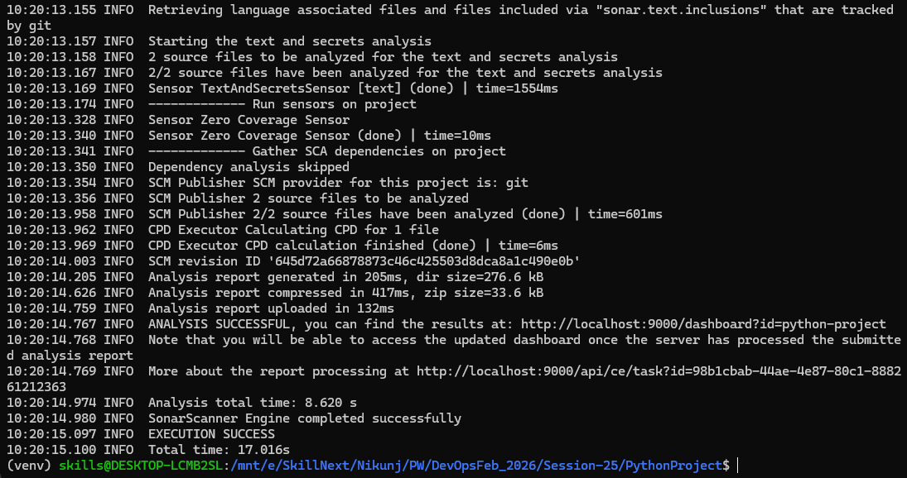
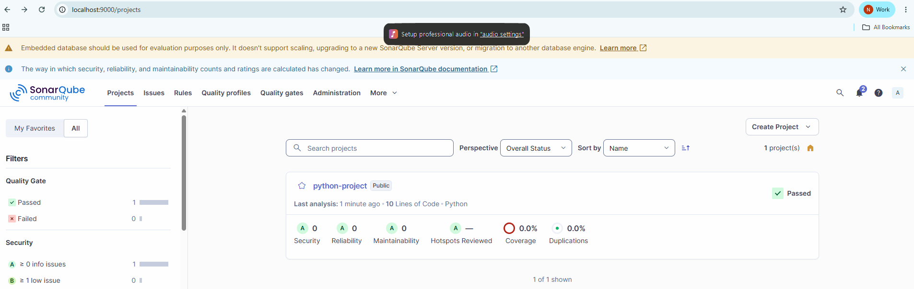

# Instructions

- to run his project in wsl create Vertual Environment
 
## Install venv package
```
sudo apt update
sudo apt install python3-venv python3-full -y
```
## Create Virtual Environment
```
python3 -m venv venv
```
## Activate Virtual Environment
```
source venv/bin/activate
```
## Update pip
```
pip install --upgrade pip
```
## Move to your project
```
cd PythonProject
```
## install your requirenments
```
pip install -r requirements.txt
```

-----------------------------------------------------------------------------------------------------------
# Code Coverage

## installation
```
pip install coverage

```
```
pip install pytest pytest-cov
```
## Run test with Coverage
```
coverage run -m pytest
```
## Generate Coverage.xml
```
coverage xml
```
Your Project Sturcture
```
PythonProject/
│
├── app/calculator.py
├── tests/test_calculator.py
├── coverage.xml
└── .coverage
```
## View Coverage report
```
coverage report
```
- Outpu
```
Name                Stmts   Miss  Cover
----------------------------------------
app/calculator.py      10      0   100%
----------------------------------------
TOTAL                  10      0   100%
```
## Generate Html Coverage
```
coverage html
```


---------------------------------------------------------------------------------------------
# Integration with SonarQube
## Create sonar-project.properties file
```
sonar-project.properties
```
```
sonar.projectKey=python-project
sonar.projectName=python-project
sonar.projectVersion=1.0

sonar.sources=app
sonar.tests=tests

sonar.python.coverage.reportPaths=coverage.xml

sonar.sourceEncoding=UTF-8
```
## Generate Token


click on (A) username on right side corner at top



- click on security



- Generate Global Token and copy it




## Run with sonar Scanner
```
/mnt/c/Users/Admin/Downloads/sonar-scanner-cli-8.0.1.6346-linux-x64/sonar-scanner-8.0.1.6346-linux-x64/bin/sonar-scanner \
-Dsonar.host.url=http://localhost:9000 \
-Dsonar.token=sqa_dbf1acd6ffb9bf03059f0e1ae8839b77ded4de85 
```


- Here given below is my path of sonar scanner for you it can be different
```
/mnt/c/Users/Admin/Downloads/sonar-scanner-cli-8.0.1.6346-linux-x64/sonar-scanner-8.0.1.6346-linux-x64/bin/sonar-scanner \
```
- goto> browser and refresh sopnarQube Server
