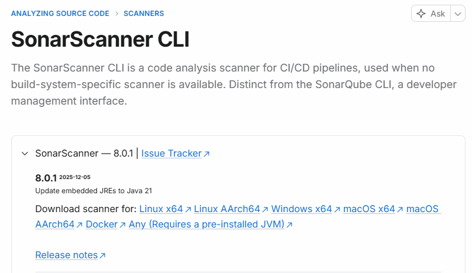
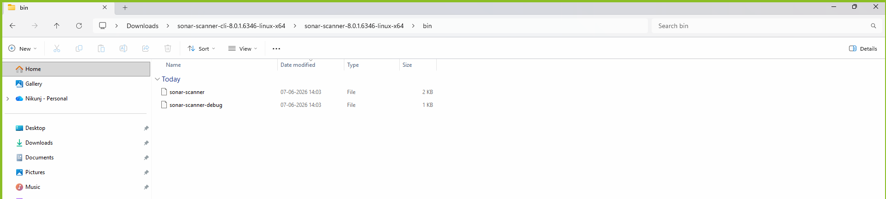

# SonarQube Scanner
The SonarScanner CLI is a code analysis scanner for CI/CD pipelines, used when no build-system-specific scanner is available. Distinct from the SonarQube CLI, a developer management interface.


- download as per your system configuartion(for wsl we donwload linux)
- extract it
- goto>sonarqube-scanner>bin>

- run
```linux
./ sonar-scanner
```