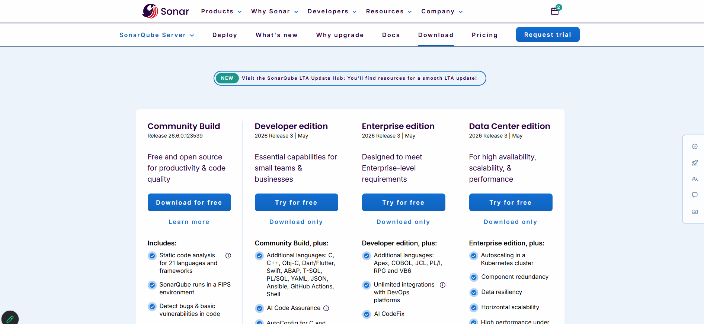
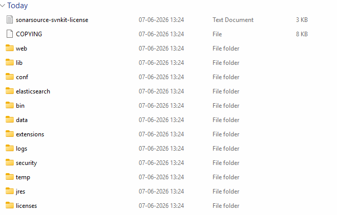
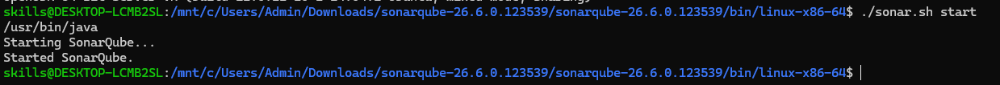
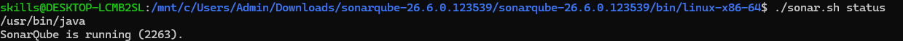
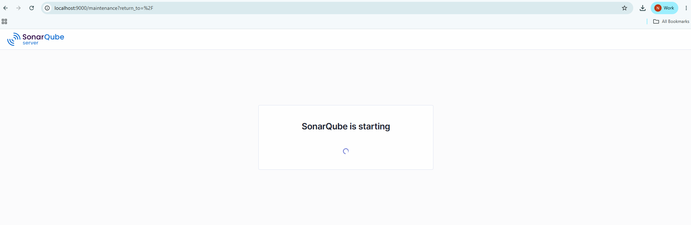
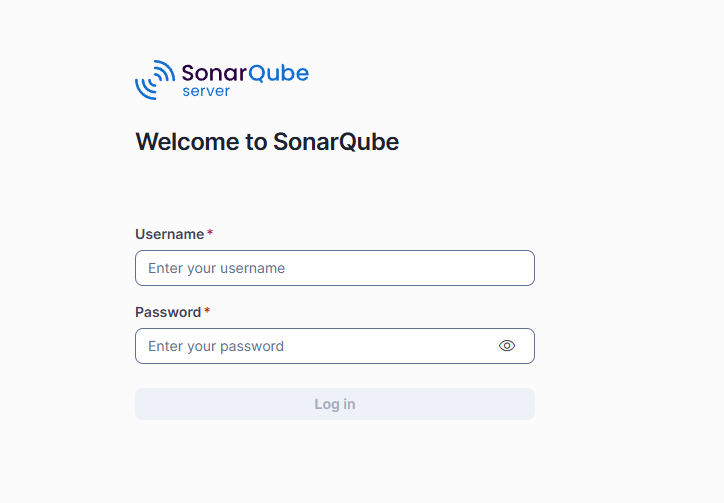
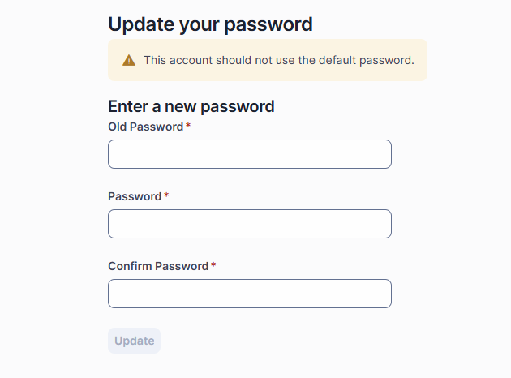
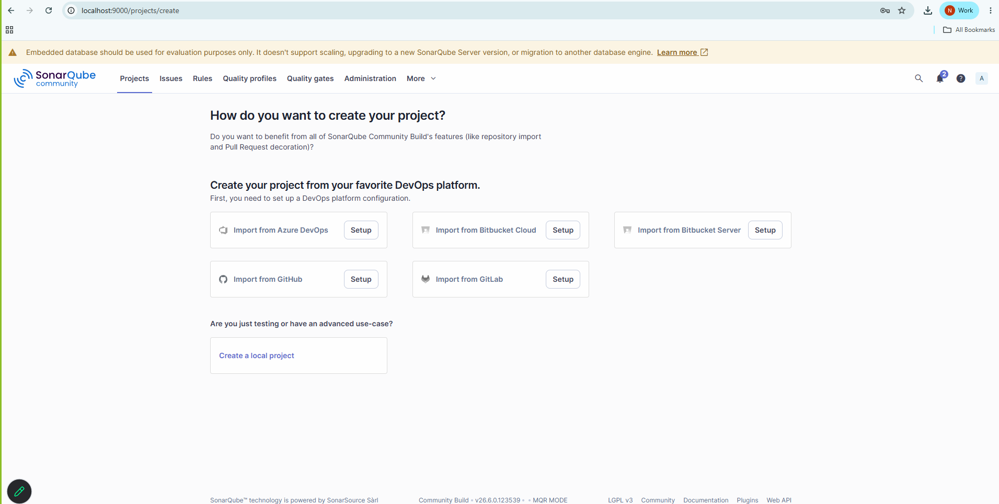

# What is SonarQube?
- SonarQube is an open-source platform used to analyze source code quality, detect bugs, find security vulnerabilities, and enforce coding standards.

- Think of it as an automated code reviewer that continuously checks your code and provides reports on issues before the application goes to production.

- When Developer writes a code , problems can occur such as:
    1. Bugs
    2. Security vulnerabilities
    3. Code Duplication
    4. Poor Coding Practise
    5. Maintanabilty issues
- SonarQube will scan the code and Generate Detailed report

## Sonar Cube Setup (Installation)
- Download Sonarcube from Below link :[Download](https://www.sonarsource.com/products/sonarqube/downloads/)

- Download Community Edition (Free)
- extract it



- goto> bin>windows(linux)> 


- open wsl> run sonarQube
- Make sure your machine has java installed in linux(for wsl) amd windows (cmd)

```
./sonar.sh start
```
- check the status

```
./sonar.sh status
```
- open browser and wait for couple of minutes
```
localhost:9000
```
 

- after some time this will be there


- login credentials
```
username: admin
password: admin

```
- after login it will ask you to change default username and password


- once new password is set update it so you will land on Dashbaord
