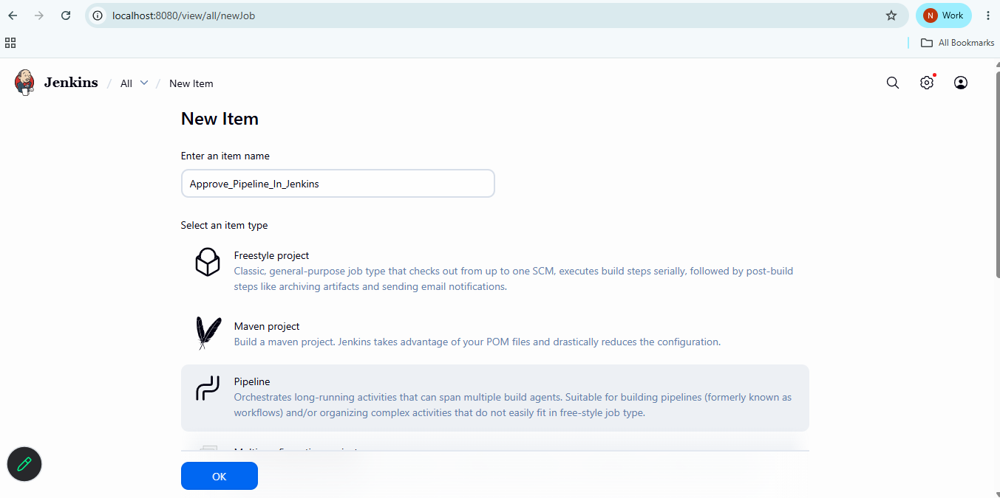
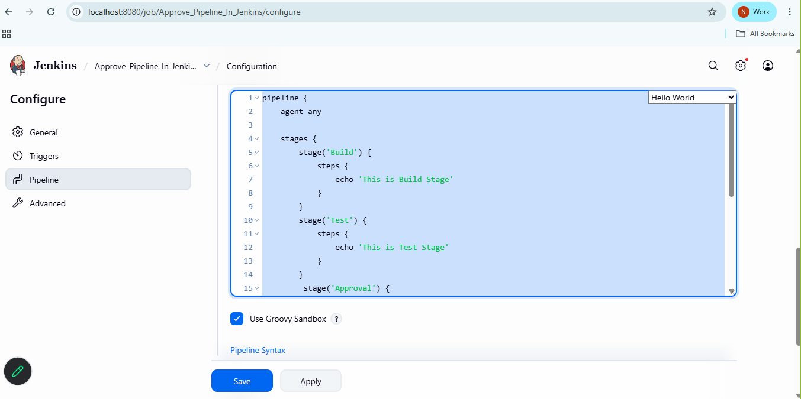
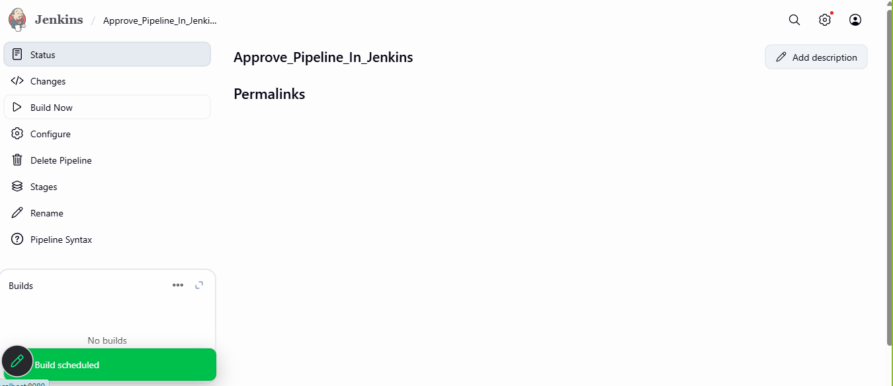
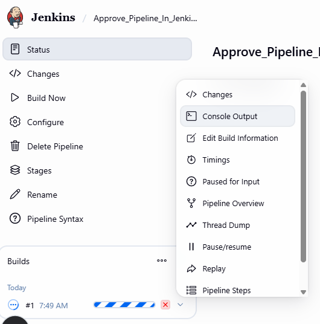
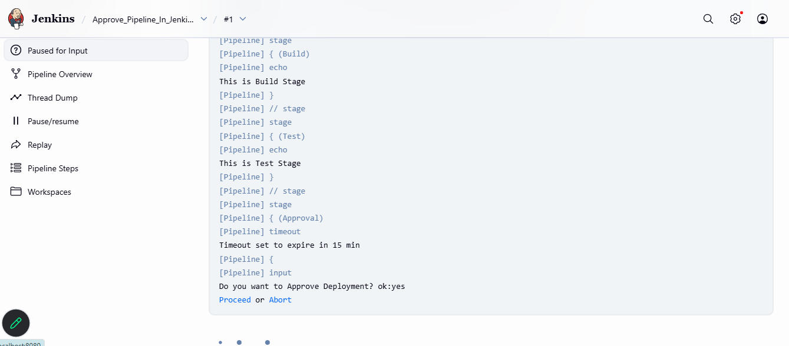
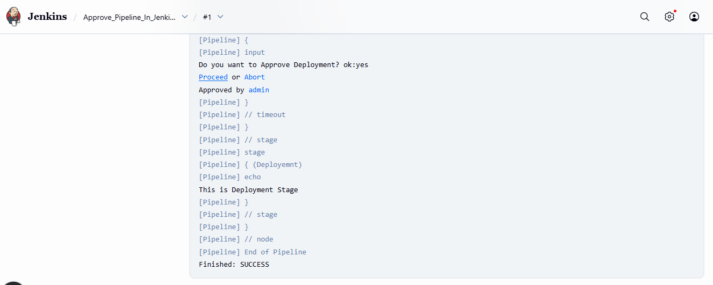

# Approve Mannualy in Jenkins Pipline
- Create Jenkins Pipline Project


- goto> pipeline and create Script


- Pipeline Script
```
pipeline {
    agent any

    stages {
        stage('Build') {
            steps {
                echo 'This is Build Stage'
            }
        }
        stage('Test') {
            steps {
                echo 'This is Test Stage'
            }
        }
         stage('Approval') {
            steps {
                timeout(time:15,unit: "MINUTES"){
                    input message:'Do you want to Approve Deployment? ok:yes'
                }
            }
        }
        stage('Deployemnt') {
            steps {
                echo 'This is Deployment Stage'
            }
        }
    }
}

```
- Click on Apply and Save
- Build The Pipeline







- Approve the Pipeline to Complete Buld Process



# Email Approval Using Jenkins Pipeline

- pipeline script
```
pipeline {
  agent any
  stages {
    stage('Build') {
      steps {
        echo 'Build successful'
      }
    }

    stage('Test') {
      steps {
        echo 'Tests passed'
      }
    }

    stage('Email for Approval') {
      steps {
        mail to: 'youremail@gmail.com',
             subject: "Approval Needed for Production Deployment",
             body: """\
Build #${env.BUILD_NUMBER} is ready for approval.

Click the following link to approve:
${env.BUILD_URL}

Login and click "Proceed" in the "Approval" stage.
"""
      }
    }

    stage('Approval') {
      steps {
        timeout(time: 10, unit: 'MINUTES') {
          input message: "Do you approve the production deployment?", ok: "Approve"
        }
      }
    }

    stage('Deploy to Production') {
      steps {
        echo 'Deploying to production...'
      }
    }
  }
}

```