# Amazon Web Services
- To Work With AWS(Amazon Web Services) You Need to Create AWS Account
- goto>google>aws login

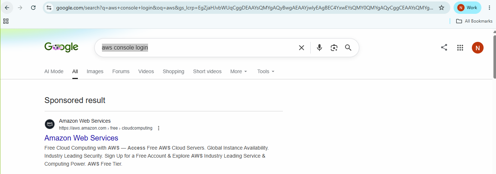

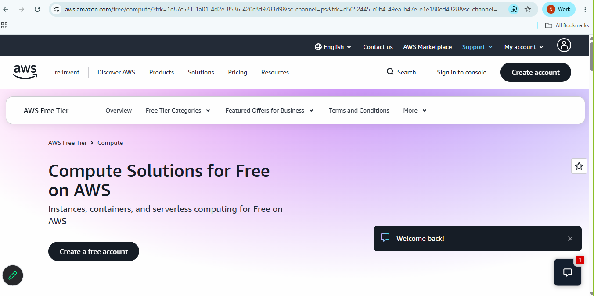

- create your account and login (For Registration Debit/Credit Card is Mendatory)
- Note: Giving Debit Card Details is a Good Practise here in AWS
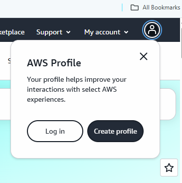

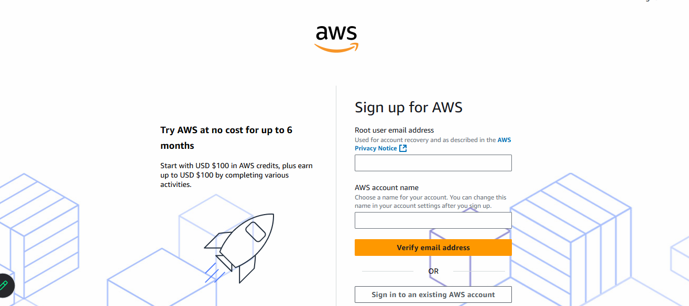
- Now Come back to Login

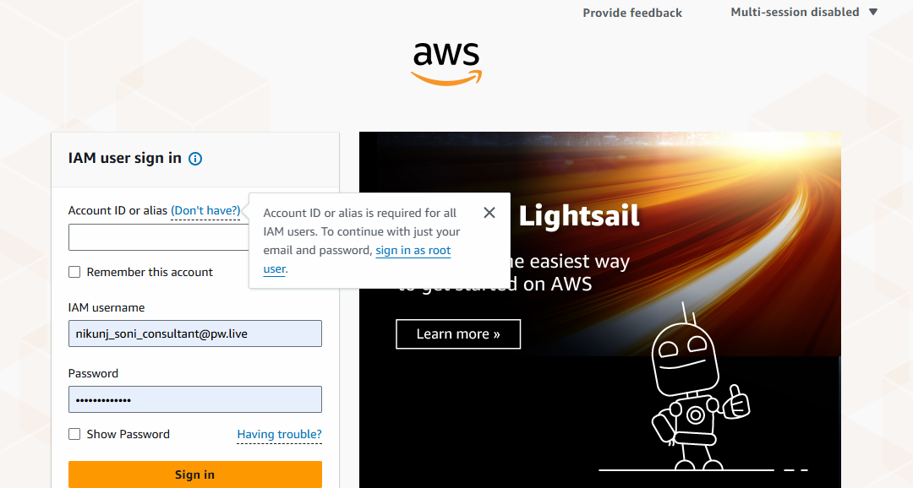
- choose Sign in using Root user

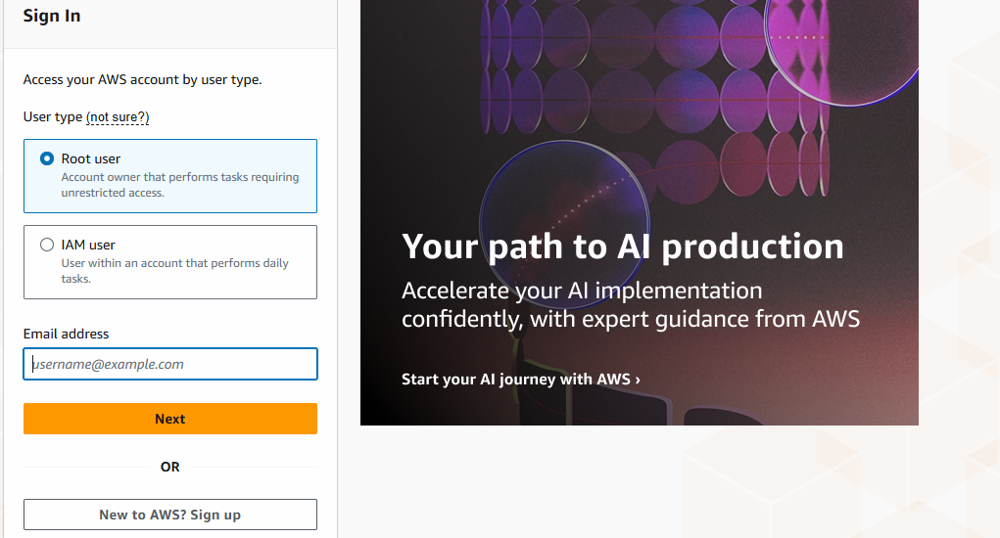

- use your registered email id and password and do the login

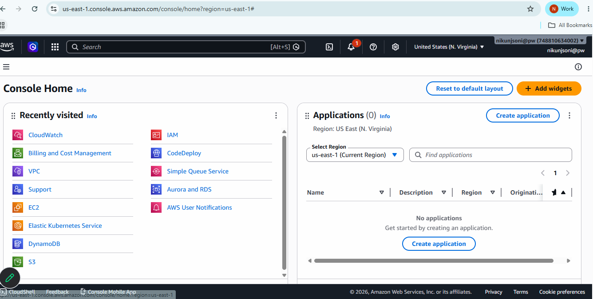

## Authenticator Application
- download Microsoft Authenticator Application
- Goto>AWS>top-right corner, select your name and number
- choose Security Credential

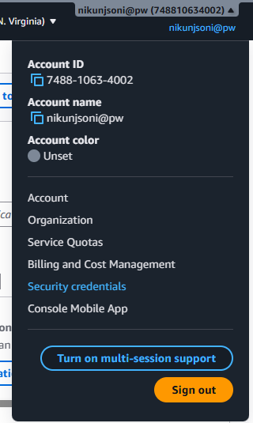
scroll down to the MultiFactor Authenticator(MFA) section and click Assign MFA Device

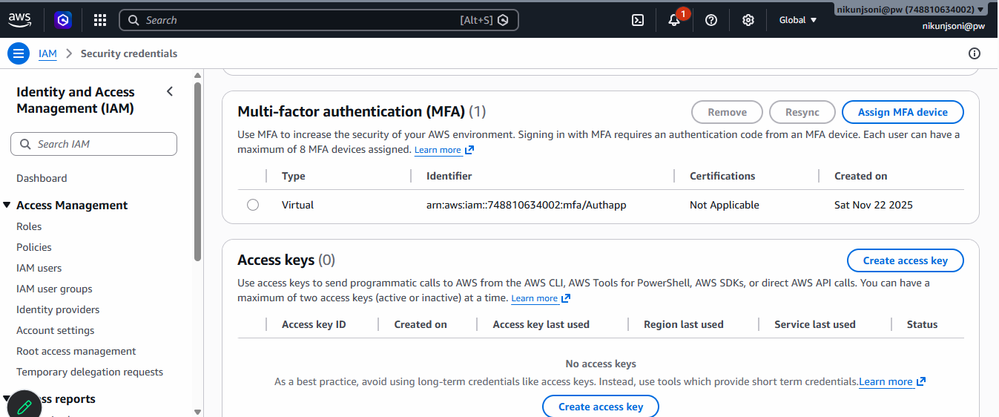

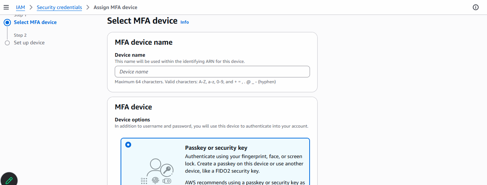

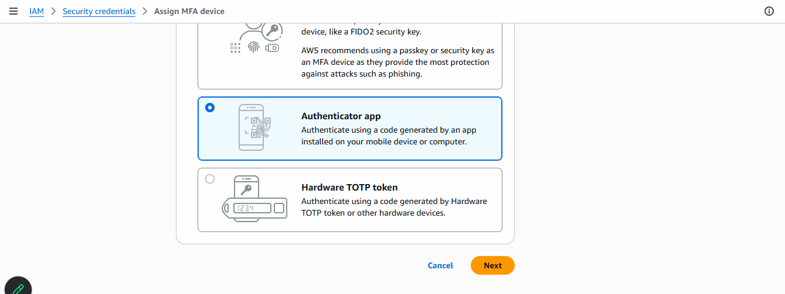

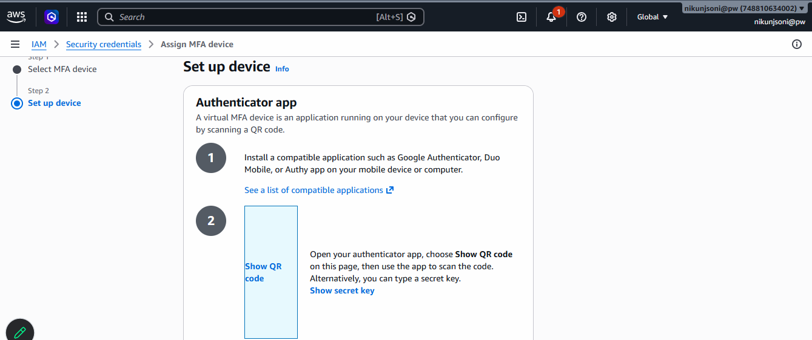

- Make Sure You are logged in in AWS and Authenticator app using same email id
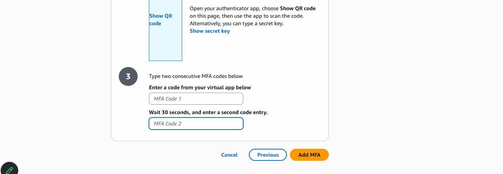

- You are Done