# Amazon Web Services
- To Work With AWS(Amazon Web Services) You Need to Create AWS Account
- goto>google>aws login

- create your account and login (For Registration Debit/Credit Card is Mendatory)
- Note: Giving Debit Card Details is a Good Practise here in AWS

- Now Come back to Login

- choose Sign in using Root user

- use your registered email id and password and do the login

## Authenticator Application
- download Microsoft Authenticator Application
- Goto>AWS>top-right corner, select your name and number
- choose Security Credential

scroll down to the MultiFactor Authenticator(MFA) section and click Assign MFA Device

- Make Sure You are logged in in AWS and Authenticator app using same email id

- You are Done

- Logout from AWS and Do the Login Again
- Now you have 3 layer Security
    - Email ---> Password -----> MFA

-----------------------------------------------------------------------
# Creating AWS Instance

- goto > AWS > Search >EC2
- EC2 is Elastic Cloud Computing

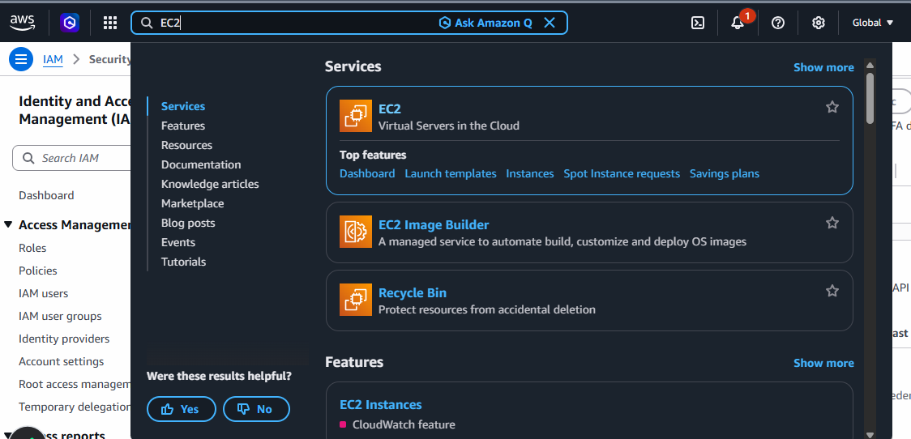

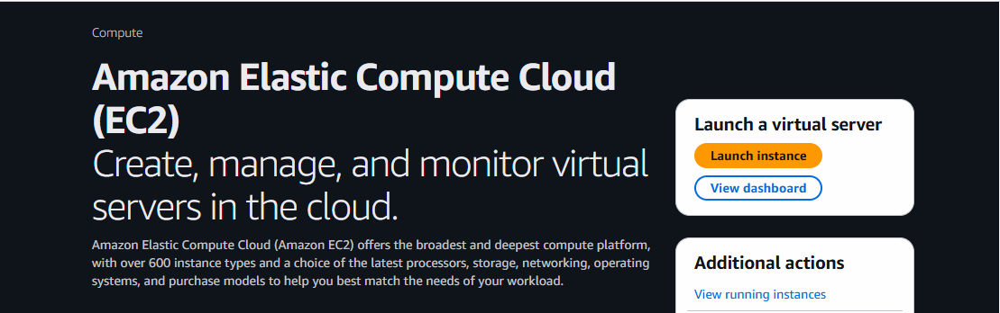

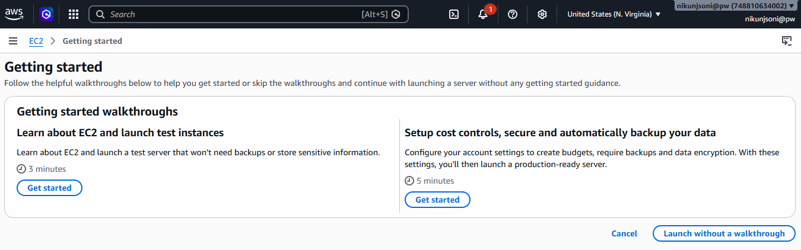

- Choose Launch Without Walk Through

- Give the Name of your Instance
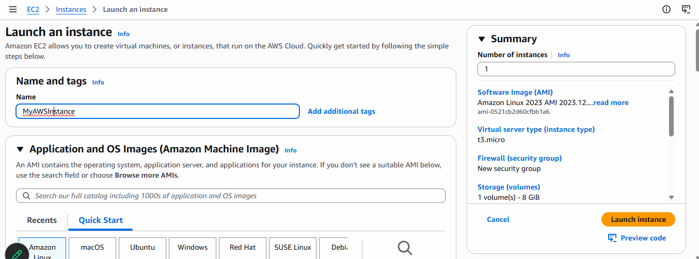

## Choose OS
- choose your OS (Linux)

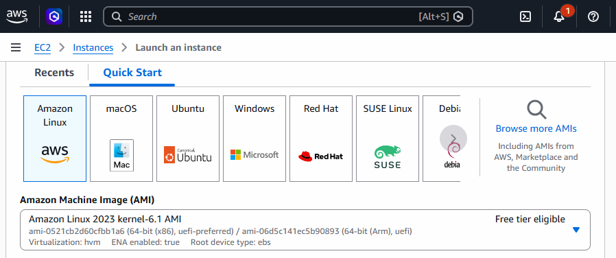

## Kernel
- choose your free tier Kernel
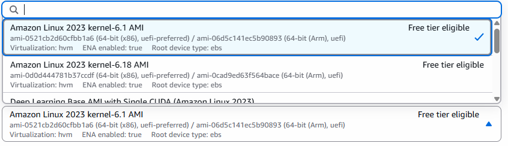

- choose Instance Type (Free Tier)
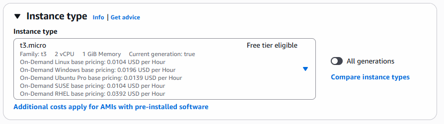

## Key Pair
- Key pair is Needed if you want to connect your local machine with aws(remote)

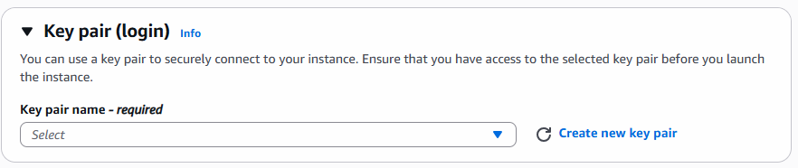

- create Key Value Pairs with RSA and .pem key
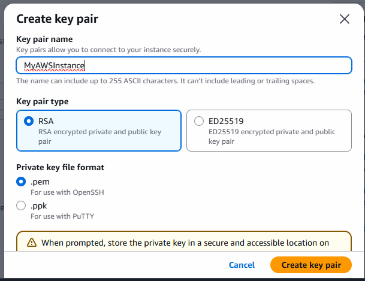
- it will automatically doenloaded to your local machine
- save it for further use
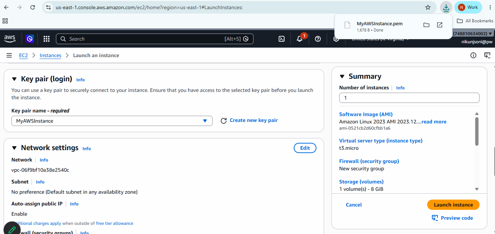

## Network Settings
- click on Edit
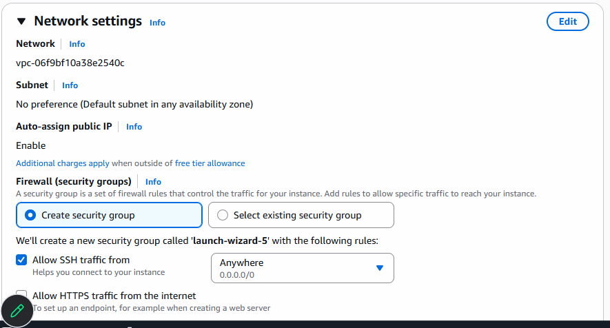

- click on add security Group Rule
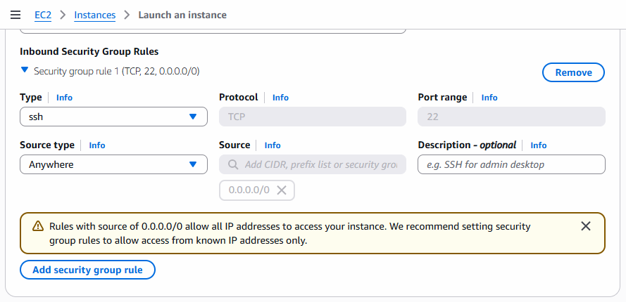

- add Port Range and Source
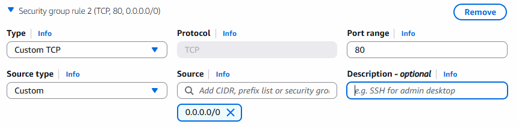 

## Storage
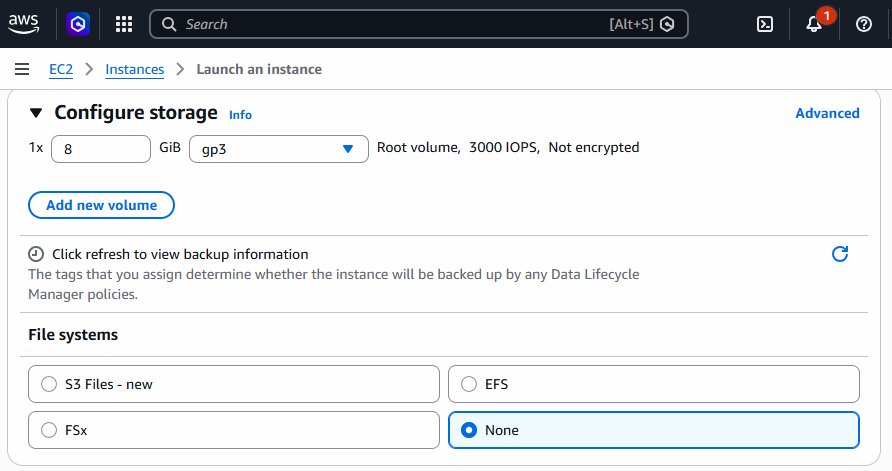

## Launch Instance
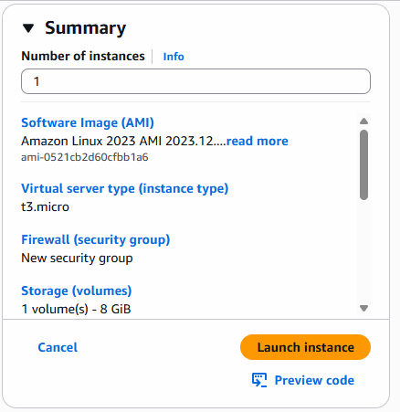

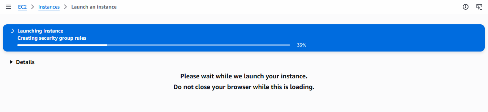

- if you are getting any error, Make sure you are in correct region while creating AWS Instance
- Generally its  'United States(N.Virginia)'
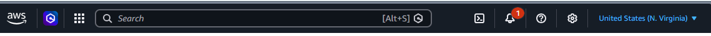

- click on instance
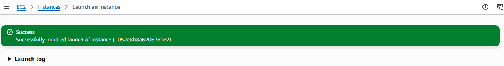

## Dashboard
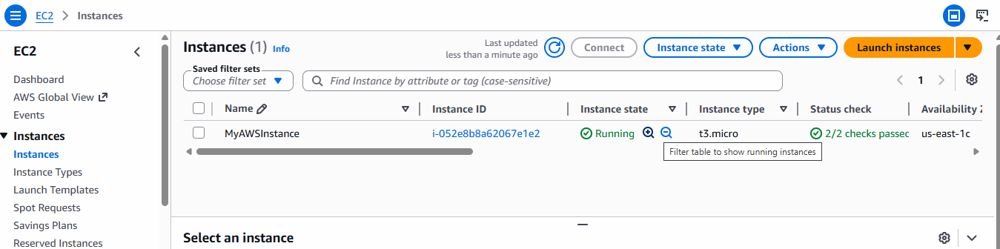