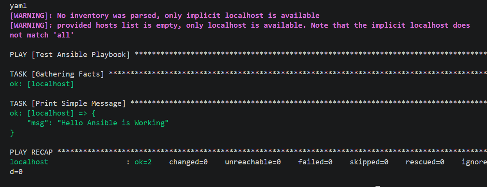
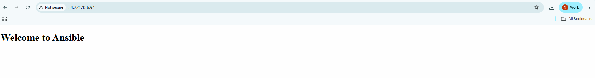

# Ansible
- It is used to automate AWS Infrasturcture

## Install Ansible in Ubuntu
```
sudo apt update
sudo apt install ansible -y
```
## Check Ansible Version
```
ansible --version
```
- Output:
```
ansible [core 2.16.3]
  config file = None
  configured module search path = ['/home/skills/.ansible/plugins/modules', '/usr/share/ansible/plugins/modules']
  ansible python module location = /usr/lib/python3/dist-packages/ansible
  ansible collection location = /home/skills/.ansible/collections:/usr/share/ansible/collections
  executable location = /usr/bin/ansible
  python version = 3.12.3 (main, Mar 23 2026, 19:04:32) [GCC 13.3.0] (/usr/bin/python3)
  jinja version = 3.1.2
  libyaml = True
```
## Create Sample Ansible Playbook
- playbook.yaml
```
---
- name: Test Ansible Playbook
  hosts: localhost

  tasks:
  - name: Print Simple Message
    debug:
      msg: "Hello Ansible is Working"
```
## Run Playbook
```
ansible-playbook playbook.yaml
```
## Output



## Install Nginx Server on AWS EC2 Instance
- Step:1 create inventory.yaml file
```
all:
  hosts:
    aws1:
      ansible_host: 3.87.205.27 (your public ipv4 address)
      ansible_user: ec2-user (your username)
      ansible_ssh_private_key_file: Ansible.pem
```
- Step:2 Create nginx.yaml file

```
---
- name: Install and Configure Nginx
  hosts: aws1
  become: true

  tasks:

    - name: Install nginx
      yum:
        name: nginx
        state: present

    - name: Copy index.html
      copy:
        src: index.html
        dest: /usr/share/nginx/html/index.html
        owner: root
        group: root
        mode: '0644'

    - name: Start and enable nginx
      systemd:
        name: nginx
        state: started
        enabled: true

    - name: Ensure nginx is running
      service:
        name: nginx
        state: started
  
```
- Step:3 Index.html
```
<!DOCTYPE html>
<html lang="en">
<head>
    <meta charset="UTF-8">
    <meta name="viewport" content="width=device-width, initial-scale=1.0">
    <title>Document</title>
</head>
<body>
    <h1> Welcome to Ansible</h1>
</body>
</html>
```
- Step:4 Run the playBook With Inventory file

```
sudo ansible-playbook -i inventory.yaml nginx.yaml
```

- Step:5 Verify Nginx Server
```
sudo ansible -i inventory.yaml aws1 -m shell -a "systemctl is-active nginx"
```
- Expected:
```
active
```

- Step:6 Open Browser
```
http://yourIpAddress
```

- Step:7 Check Security Group for Port 
 
| Type | Port | Source    |
| ---- | ---- | --------- |
| SSH  | 22   | Your IP   |
| HTTP | 80   | 0.0.0.0/0 |

- Step:8 Open Browser and Check again
```
http://yourIpAddress
```
