# AWS CLI(Command Line Interface)
- it is used to connect local machine with Remote Server

## Installation (WSL)
```
curl "https://awscli.amazonaws.com/awscli-exe-linux-x86_64.zip" -o "awscliv2.zip"
unzip awscliv2.zip
sudo ./aws/install
```

## Check the Version
```
aws --version
```
- Output:
```
aws-cli/2.33.2 Python/3.13.11 Linux/6.6.87.2-microsoft-standard-WSL2 exe/x86_64.ubuntu.24
```
## OPEN AWS Console
- Goto> Search> Type: I am
- Select I AM Users (Right Side)
- Create New User
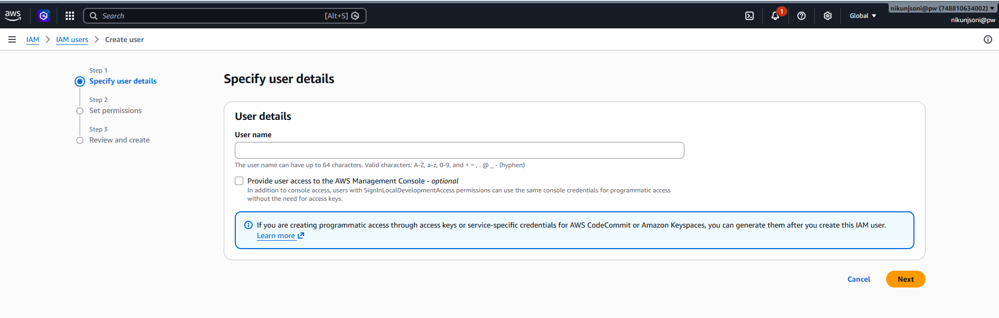

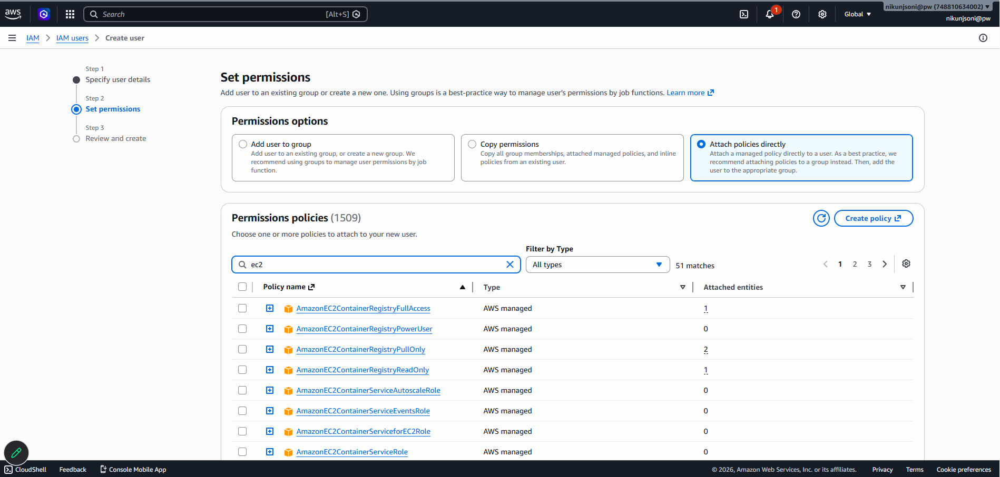

- choose ec2 Full Access
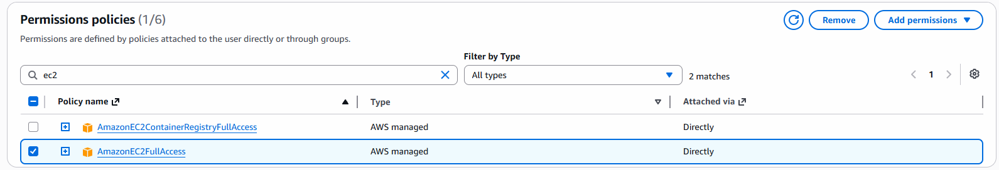

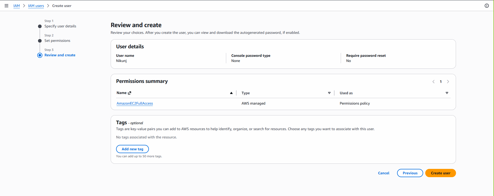

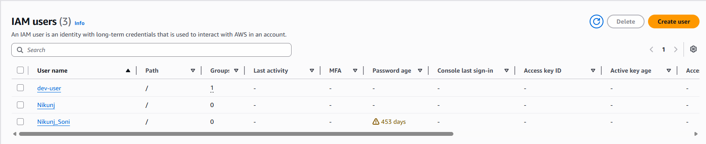

- Create Access Key
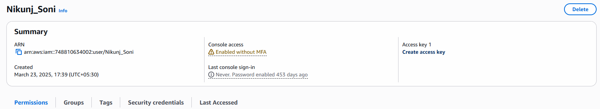

- choose CLI
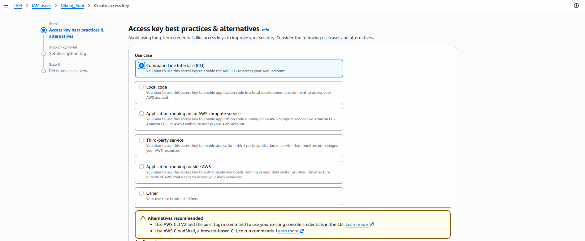

- confirm the checkbox and click Next

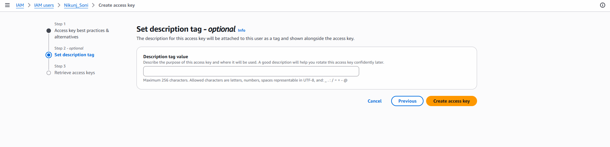

- click on Create Access Key
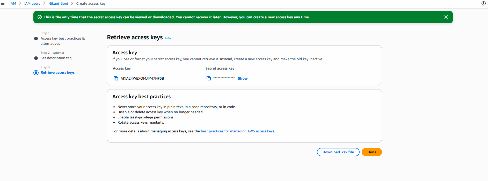

- copy the Access Key And Secreat Key Some where on your System (Or Download .CSV File)

- Click on Done

## Open WSL
- configure aws
```
aws configure
```
- Fill The Below Details From AWS Access Key, Secrete Key, AWS Region, JSON Format
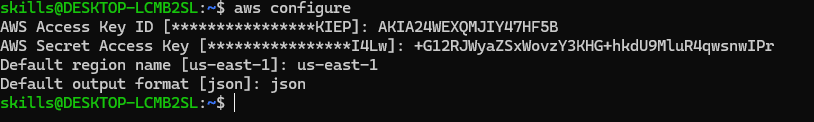
- You Are All Set With REMOTE and LOCAL Server Connectivity

## Create New AWS Instance
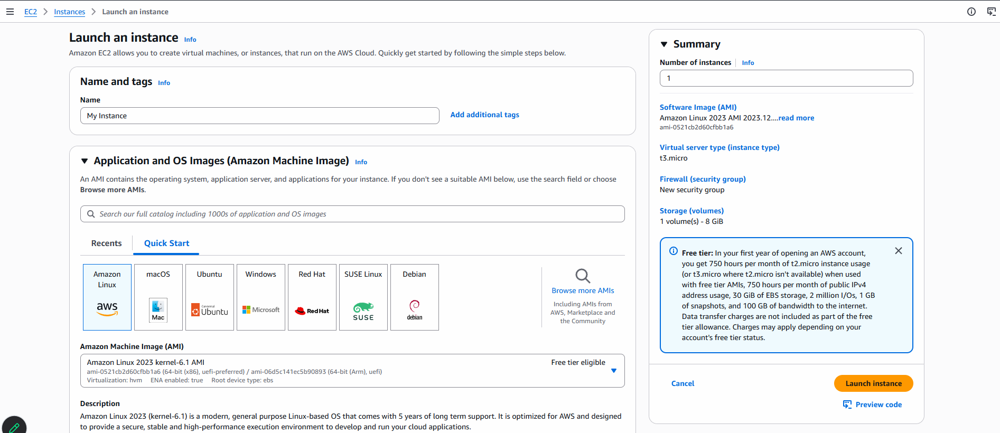

- Choose Default AWS Linux Instance,t3.micro 

- Create New KEY Value Pair
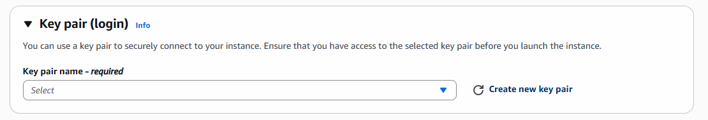

- Now Download that Recent Key Value Pair
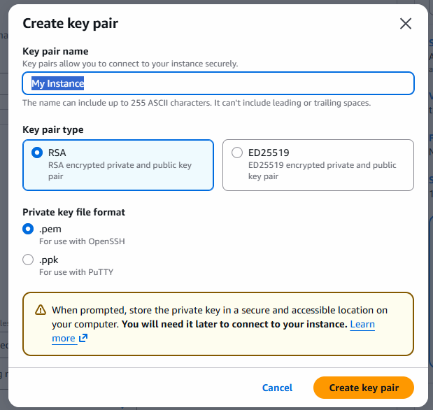

- Create New Key Value Pair
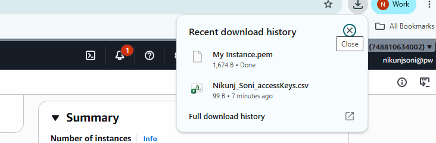

- goto > Download Folder and Open WSL there (Make Sure Key .pem is Available in that Folder)
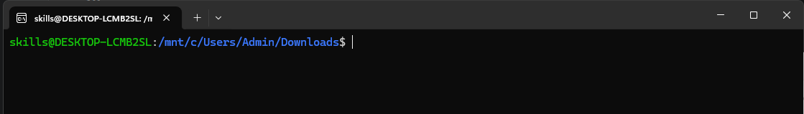

- Add Network Settings on aws

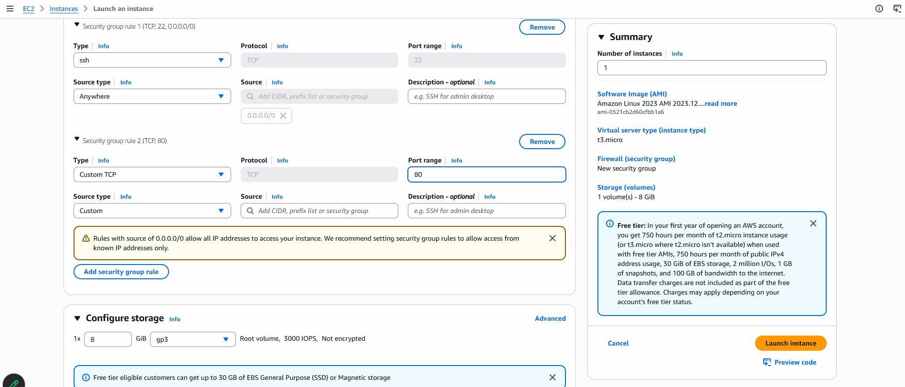
- Launch the instance

- Choose the recent instance and click on connect

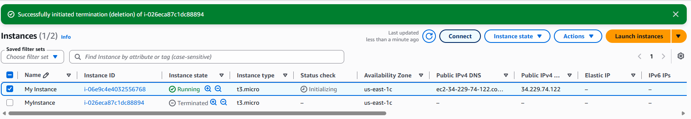

- Choose SSH
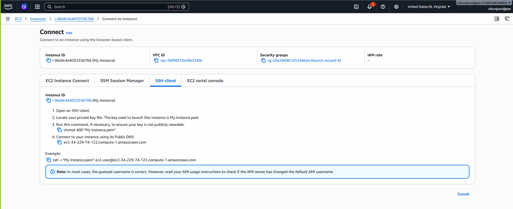

- copy Example

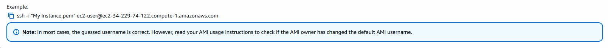

## Open WSL 
- Paste the Copied SSH (add sudo at the Begining of ssh)
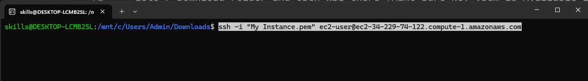

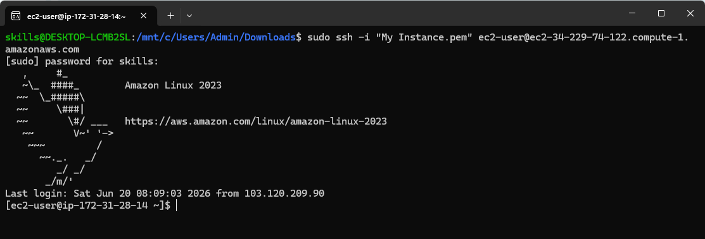

- We are Done with Connectivity
