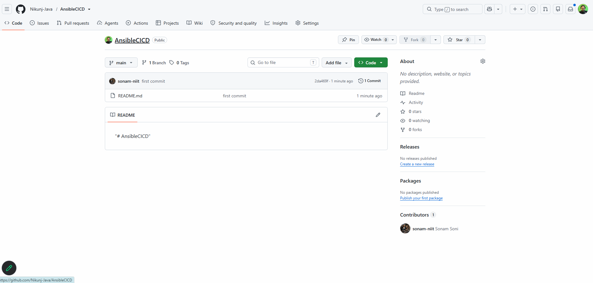
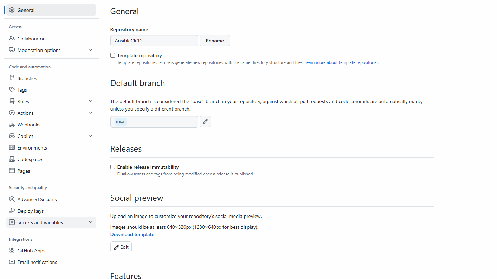
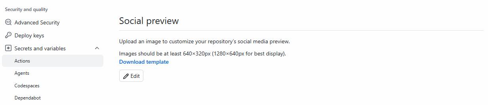
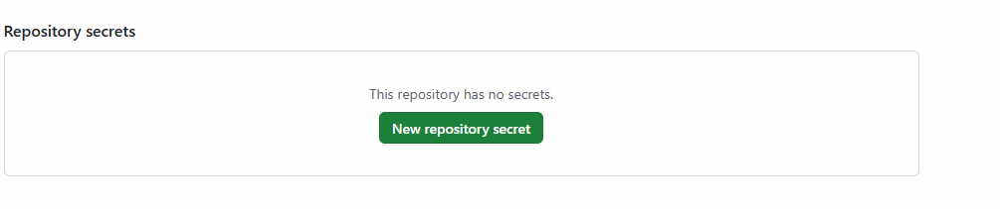
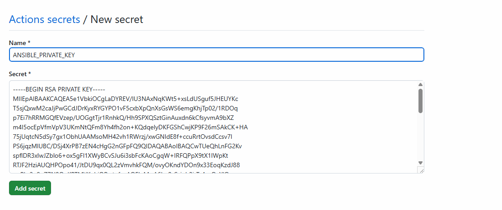
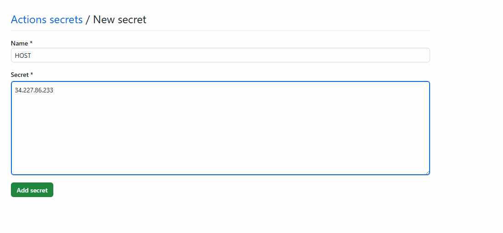
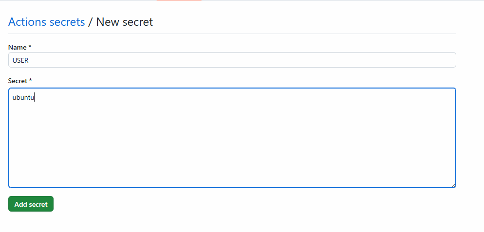
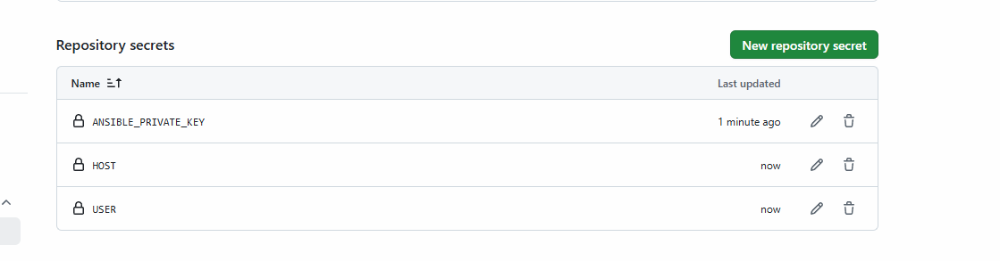

# Deploy Application using Ansible + Github Action
- in this tutorial We will Deploy Application using ansible + aws + github-action 

## Step:1 Create AWS Ubuntu Instance
- copy/ download Below Details
```
public_ip_address: 
private.pem key
Username: ubuntu
```

## Step:2 Create Github Repository and Configure the Secrets
- Follow This Step By Step:
- 1. Goto> Settings


- 2. Choose> Secrets and Variables


- 3. Choose> Actions


- 4. New Repository Secrets


- 5. New Repository Secrets (AWS PRIVATE KEY)
 


- 6. New Repository Secrets (AWS HOST PUBLIC IP)


- 7. New Repository Secrets (AWS HOST USERNAME)


- 8. Check all Secrets are Added 


## Step:3 Push the code to the Github Repository