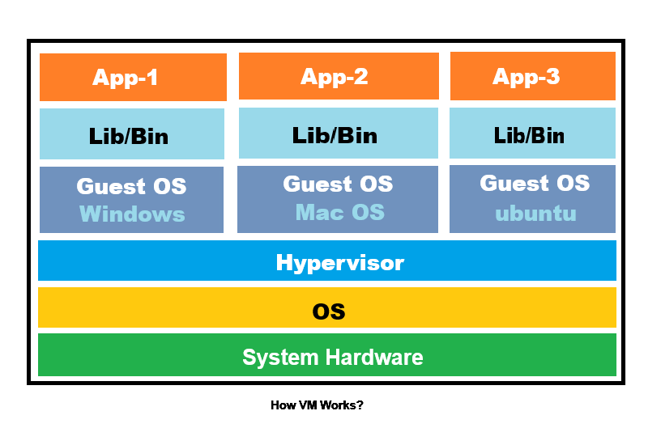
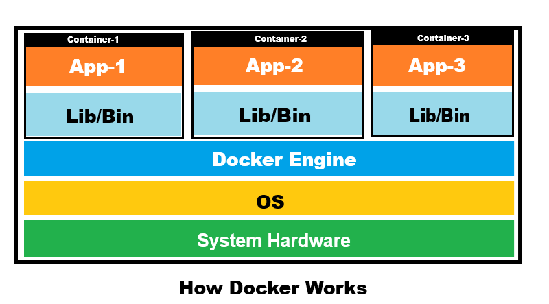

# Docker Fundamentals
## Working of VM

- Each Virtual Machine Has its own OS - Bulky
- Multiple VM's Lead to Unstable Infrastructure Performance
- Slow Boot up Process, Slow Software Upgrade, Everything will become lagging Process

## Working of Docker

- one common OS for All - Light Weight
- it is based on Containers
- High Boot up process, Fast, Easy Upgradable

## Working of Docker
- Docker has following Component
    - 1. Docker Client
    - 2. Docker Image
    - 3. Docker Containers
    - 4. Docker Registry
    - 5. Docker Daemon 
    - 6. Docker Host
## 1. Docker Client
```
- it is primary interface you use to interact with Docker(User interface CLI/UI or Client)
- it accept User Commands
- Eg: docker run , docker build
```

## 2. Docker Image
```
- A docker image is read-only template contains instructions to create Container
- it includes application code
- it buld with a text file called 'Dockerfile'
- it cannot be changed, You must build New Image to make updates
```

## 3. Docker Containers
```
- A docker Container is runnable, isolated intance of Docker image
- it adds writable layer on the top of read only image layer
- it is aolated application from the host system and other containers
- it can be stopped, started, moved and deleted easily
```
## 4.Docker Registry(Hub)
```
- A docker Registry is Centralizeed Storage System used to share Docker Image
- you can share your newly created image of any application to your DockerHub Account
- You can Register to your account via This Link: [text](https://hub.docker.com/)
- this can be private, hosted, public
```
## 5.Docker Daemon 
```
- A docker Daemon (dockerd) is a background service that does the heavy liftng
- it listed for API  request from the Docker Client
- it manages all docker objects,including images, container, networks and volumes
```
## 6.Docker Host
```
- A Docker Host is a Physical Machine or VM running on Docker
- it provided the hardware resources like RAM, CPU, MEMORY and STORAGE
- it can be personal laptop, or server in the cloud

```
## Docker Architecture


## How to start with docker ?
- Install dokcer in linux/Ubuntu [Reference Link](https://docs.docker.com/engine/install/ubuntu/)

```
# Add Docker's official GPG key:
sudo apt update
sudo apt install ca-certificates curl
sudo install -m 0755 -d /etc/apt/keyrings
sudo curl -fsSL https://download.docker.com/linux/ubuntu/gpg -o /etc/apt/keyrings/docker.asc
sudo chmod a+r /etc/apt/keyrings/docker.asc

# Add the repository to Apt sources:
sudo tee /etc/apt/sources.list.d/docker.sources <<EOF
Types: deb
URIs: https://download.docker.com/linux/ubuntu
Suites: $(. /etc/os-release && echo "${UBUNTU_CODENAME:-$VERSION_CODENAME}")
Components: stable
Architectures: $(dpkg --print-architecture)
Signed-By: /etc/apt/keyrings/docker.asc
EOF

sudo apt update

sudo apt install docker-ce docker-ce-cli containerd.io docker-buildx-plugin docker-compose-plugin

sudo systemctl status docker

sudo systemctl start docker

docker --version

sudo docker version
```
[Windows Setup](https://docs.docker.com/desktop/setup/install/windows-install/)
[Mac Setup](https://docs.docker.com/desktop/setup/install/mac-install/)

## Understand Command Execution
```
sudo docker run hello-world
# hello-world is the image
# if if image is not available locally Docker Daemon will Download from Docker Hub
# and container executed when you create the container and see the output
```
- OUTPUT: 
```
Unable to find image 'hello-world:latest' locally
latest: Pulling from library/hello-world
4f55086f7dd0: Pull complete
d5e71e642bf5: Download complete
Digest: sha256:96498ffd522e70807ab6384a5c0485a79b9c7c08ca79ba08623edcad1054e62d
Status: Downloaded newer image for hello-world:latest

Hello from Docker!
This message shows that your installation appears to be working correctly.

To generate this message, Docker took the following steps:
 1. The Docker client contacted the Docker daemon.
 2. The Docker daemon pulled the "hello-world" image from the Docker Hub.
    (amd64)
 3. The Docker daemon created a new container from that image which runs the
    executable that produces the output you are currently reading.
 4. The Docker daemon streamed that output to the Docker client, which sent it
    to your terminal.

To try something more ambitious, you can run an Ubuntu container with:
 $ docker run -it ubuntu bash

Share images, automate workflows, and more with a free Docker ID:
 https://hub.docker.com/

For more examples and ideas, visit:
 https://docs.docker.com/get-started/
```
- list the images
```
sudo docker ps
```
- output:
```
hello-world:latest                                               96498ffd522e       25.9kB         9.49kB    U
```
- list all container
```
sudo docker ps -a
```

## Example: Working with MYSQL
```
sudo docker pull mysql
sudo docker images
```
- output:
```
mysql:latest                                                                                        ad88e1c86cbf       1.28GB          288MB
```
-------------------------------------------------------------------------
## Exercise:1
-------------------------------------------------------------------------
1. pull the images
```
sudo docker pull docker/getting-started
```
2. list the image
```
sudo docker images
```
3. Run the Container with Specific Port Number
```
sudo docker run -p 80:80 docker/getting-started
```
4. if you want to run containeer in Background (just add -d)
```
sudo docker run -p 80:80 -d docker/getting-started
```
5. get the list of containers running
```
sudo docker container ls
```
6. check the output on Browser
```
http://localhost:80
```
7. To Stop Container
```
 sudo docker stop <name of container>
```
8. To Start Container
```
sudo docker start <name_of_container>
```
9. To Remove Container
```
sudo docker rm <name_of_container>
```
10. TO Remove Container Forcefully 
```
sudo docker rm -f <name_of_container>
```

------------------------------------------------------------------------------
## Exercise: 2 Pull the Available images from docker Registry
------------------------------------------------------------------------------
- 1. pull ubuntu from registry
```
sudo docker pull ubuntu
```
- 2. pull ubuntu from registry
```
sudo docker pull mysql
```
- 3. pull ubuntu from registry with specific version
```
sudo docker pull mysql:5.7
```
## Remove Images 
- to remove images make sure it is not used in any container
- if any container uses the Docker image, First Stop that container and then try to remove the image
```
docker ps -a
```
```
sudo docker rmi mysql
sudo docker rmi ubuntu
sudo docker rmi getting-started
```
------------------------------------------------------------------------------
## Exercise: 3 Pull The Custom Image(Git Hub)
------------------------------------------------------------------------------
- github repo: [Docker Master](https://github.com/Nikunj-Java/docker_master.git)
- 1. clone the repositorty
```
git clone https://github.com/Nikunj-Java/docker_master.git
```
- 2. get the list of directory
```
ls
```
- 3. Prepare image in docker container
```
sudo docker build -t dockermaster .
```
- note: Here (.) is mendatory

- 4. check the image
```
sudo docker images
```

- 5. run the container
```
sudo docker run -d --name mycontainer1 -p 80:80 dockermaster
```
- Note: 
   - mycontainer1 : name of your custom container
   - dockermaster : name of your github image
- 6. check the container
```
sudo docker container ls
```
Or
```
sudo docker ps -a
```
- 7. Open in Browser
```
http://localhost:80
```
- Note: (if not working in normal browser, open it with incognito window)
------------------------------------------------------------------------------
## Exercise: 4 Create Node js Application and Docker File
------------------------------------------------------------------------------
## Step:1 Node.js Application
- create new folder 'nodeapp' 
```
mkdir nodeapp
```
- create node environment
```
npm init -y
```
- create index.js
```
// Import the built-in HTTP module
const http = require('http');

// Define the server host and port
const port = 3001;

// Create the HTTP server instance
const server = http.createServer((req, res) => {
  // Set the response HTTP status and Content-Type header
  res.statusCode = 200;
  res.setHeader('Content-Type', 'text/plain');
  
  // Send the response text and close the connection
  res.end('Hello, World!\n');
});

// Start listening for incoming network requests
server.listen(port, () => {
  console.log(`Server running at http://localhost:${port}/`);
});


```
- Note Run This Application Locally Before Starting With Docker Images (move to app folder and run 'node index.js')
- Node js Application Runs on port 3000
- if you don not have node js download from here [Node Js](https://nodejs.org/en/download)

## Step:2 Dockerfile
``` 
# Base Image
FROM node:22-alpine

# Set Working Directory
WORKDIR /app

# copy package.json
COPY package.json .

# install dependencies
RUN npm install

# Copy other files and folders
COPY . .

# EXPOSE PORT
EXPOSE 3001

# RUN APP
CMD ["node","index.js"]
```

## Step:3 Build Docker Image
```
sudo docker build -t mynodeapp .
# build to build an image
# -t target(tag) name of image
# . inidicates location of Dockerfile which is root location
sudo docker images
```

## Step:4 Deploy Docker Image To Docker Container
```
sudo docker run -d --name nodecontainer1 -p 3001:3001 mynodeapp
sudo docker container ls
sudo docker ps -a
sudo docker logs myapp
```

## Step:5 Open Browser
```
http://localhost:3001
```