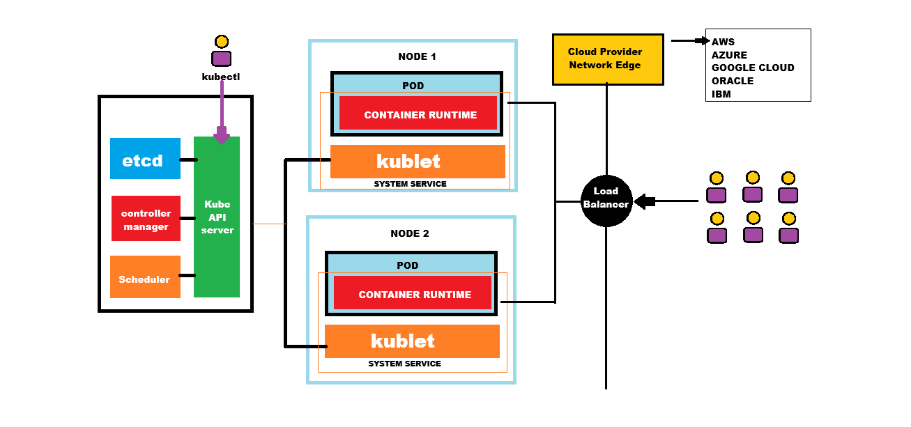
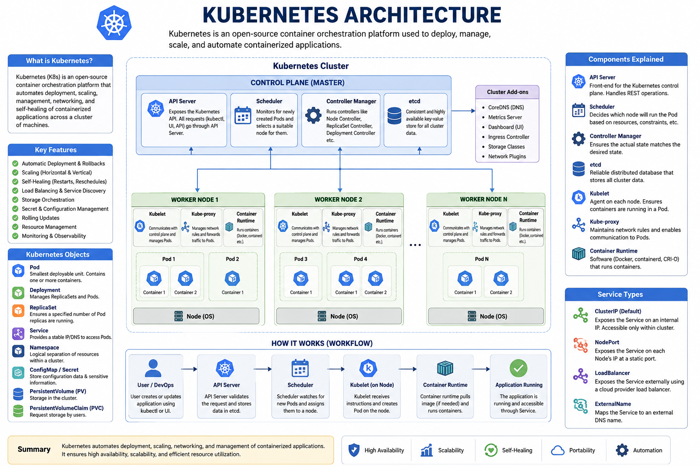
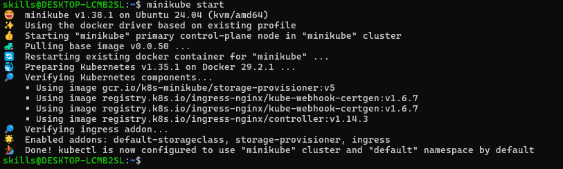

# Kubernetes
- Kubernetes (also knows as k8s) is an open-source container orchestration tool platform used to deploy , manage, scale, and automate containerized application
- it is written in Go-Language as it is developed by Google
- now it is being maintained by Cloud Native Computing Foundation.

## Why Do We Need Kubernetes ?
- Running a few containers manually with Docker is easy. However, in a production environment, you may have hundreds of containers running across multiple servers.

- Managing them manually becomes difficult because you need to:

    - Restart failed containers automatically.
    - Scale the application during high traffic.
    - Distribute traffic among multiple container instances.
    - Perform rolling updates without downtime.
    - Manage networking and storage.

- Kubernetes automates all of these tasks.

## Kubernetes Architecture
```
                           Kubernetes Cluster
                        --------------------------
                               Control Panel
                        --------------------------
                        API Server 
                        Scheduler
                        Controller Manager
                        etcd (Cluster Database)
                        -------------------------
                                Worker Nodes
                        -------------------------
                        node 1             node 2
                        ------             ------
                        pod(App)           pod (App)
                        pod(DB)            pod(DB)
```
```
[ Kubernetes Cluster ]
        │
        ├──► [ Node 1 (Server) ]
        │          ├──► [ Pod A ] ──► (Containers)
        │          └──► [ Pod B ] ──► (Containers)
        │
        └──► [ Node 2 (Server) ]
                   ├──► [ Pod C ] ──► (Containers)
                   └──► [ Pod D ] ──► (Containers)

```
## Amin Compoenents
### 1. Cluster
A Kubernetes Cluster consist of:
- one Control Panel
- One or more Worker Nodes
### 2. Node
- A Node is a machine(Physical or Virtual) where Containers run
- each Node includes
    - kubelete
    - Container runtime(Docker , containerd, etc.)
    - kube proxy
### 3. Pod
- a pod is the smallest deployable unit in kubernertes
- a pod contains :
    - One or more Containers
    - shared Networking
    - shared storage
### 4. Deployemnt
- A deployment manages pods.
- it can create,update,replace failing pods, rolling update, rollback

### 5. Service
- pods can have changind ip addresss.
- A service provides stable ip addresses or DNS name accros pods
- types:
    ClusterIP
    NodePort
    LoadBalancer
    ExternalName

### 6. ReplicaSet
- A replicaset ensures a specified Number of pods replicas are always running
- if one of the pod crashes it will create or restart the new pod automatically


## 7. Namespace
- Namespace logically separatess resources within cluster
- Example
    deafult
    kube-system
    dev
    prod




## Installtion
[Referenece Link](https://kubernetes.io/docs/setup/)
[Minikube](https://minikube.sigs.k8s.io/docs/start/)

```
# Installation
curl -LO https://github.com/kubernetes/minikube/releases/latest/download/minikube-linux-amd64
sudo install minikube-linux-amd64 /usr/local/bin/minikube && rm minikube-linux-amd64

# Permission Related Error
sudo usermod -aG docker $USER
newgrp docker
# 
# Start Your Cluster
minikube start

# if its configured
kubectl cluster-info

kubectl get nodes
#  you can see single machine as control-plane which is master node
```


## Setting up Kubectl in Ubuntu
```
# Download the latest release with the command:
  curl -LO "https://dl.k8s.io/release/$(curl -L -s https://dl.k8s.io/release/stable.txt)/bin/linux/amd64/kubectl"

# Validate 
curl -LO "https://dl.k8s.io/release/$(curl -L -s https://dl.k8s.io/release/stable.txt)/bin/linux/amd64/kubectl.sha256"

echo "$(cat kubectl.sha256)  kubectl" | sha256sum --check
# you can see Kubectl:OK
sudo install -o root -g root -m 0755 kubectl /usr/local/bin/kubectl

kubectl version --client
```

## Setting up a cluster using minikube
```
curl -LO https://github.com/kubernetes/minikube/releases/latest/download/minikube-linux-amd64
sudo install minikube-linux-amd64 /usr/local/bin/minikube && rm minikube-linux-amd64

miniube start
minikube status
kubectl cluster-info
kubectl get nodes # check Connected Nodes
kubectl dashboard --url # access Minikube IP
```
- if kubectl is not working re-configure it
```
curl -LO "https://dl.k8s.io/release/$(curl -L -s https://dl.k8s.io/release/stable.txt)/bin/linux/amd64/kubectl"

sudo install -o root -g root -m 0755 kubectl /usr/local/bin/kubectl

kubectl version --client

```
## Create a POD
```
kubectl run my-pod --image=nginx --port=80
kubectl get pods
kubectl describe pod my-pod
```
## Create Service
- Expose an application running in your cluster behind a single outward facing endpoint, even when the workload is split accross multiple backends
```
kubectl expose pod my-pod --type=NodePort --port=80
```
```
kubectl get svc
```
```
minikbe service my-pod
```

## Create Pod and Service uing YML
1. create my-pod.yml
2. create my-service.yml
[reference Link](../Session-36)
```
kubectl apply -f my-pod.yml
kubectl get pods
kubectl describe pod nginx

kubectl apply -f my-service.yml
kubectl get pods
minikube service my-service
```
## Types of Kubernetes Services
```
                   Kubernetes Service
                          |
    -------------------------------------------------
    |               |             |                |
 ClusterIP      NodePort      LoadBalancer    ExternalName
                          |
                     (Headless Service)
```
## 1. ClusterIP (Default)
- Exposes the application inside the Kubernetes cluster only
- Not Assecible from the outside the cluster
- Default Service type is none is specified
```
Client Pod
     |
     v
+-------------------+
| ClusterIP Service |
+-------------------+
     |
     v
+-------------------+
|      Pod 1        |
|      Pod 2        |
|      Pod 3        |
+-------------------+
```
### Use Cases:
```
Backend API
Databases
MicroService Communication
```

## 2. NodePort
- exposes the applicationon every worker node
- accessible using:
```
NodeIP: Nodeport
```
- kubernetes assigns a port from 3000-32767(or you specify one).
```
Browser
   |
NodeIP:30080
   |
+----------------+
| NodePort       |
+----------------+
        |
        v
+----------------+
| ClusterIP      |
+----------------+
        |
        v
 Pods
```
### Use Cases
```
- Developemnt
- Testing
- Minikube
- Small Cluster
```

## 3. LoadBalanacer
- creates an external could load balancer.
- Requires cloude provider such as AWS,AZURE or GCP
```
Internet
     |
Load Balancer
     |
ClusterIP Service
     |
 Pods
```

## 4. ExternalName
- Maps a Kubernetes Service to an External DNS Name
- No Pods or Proxing Involve

```
Application
      |
ExternalName Service
      |
      v
api.example.com
```
### Use Cases
```
- External Databases
- ThirtParty API
```

## 5. Headless Service
- creating by setting clusterIp:None
- Kubernetes doesnot assign Virtual IP
- Client receives the individual PODS ips directly through DNS
```
Application
      |
DNS Lookup
      |
-------------------------
|      |        |
Pod1   Pod2    Pod3
```
--------------------------------------------------------------------------------------------------
# StatfelSet
--------------------------------------------------------------------------------------------------
- it is k8s workload API object which is usually used to manage stateful application
- Maintains Stable network: POD is having unique name
- Ordered Deployment and Scaling: pods start in sequence based on rescheduled
- Stable Pod name:Like myapp-0 myapp-1 myapp-2

## When to use StatefulSet?
-----------------------------
-- Distributed System : Kafka, Zookepeer
-- Datbases: MySQL, PostgreySQL, MongoDB

---------------------------------------------------------------------------------------------------
## Exercise: 1  Deploy MySQL Databse using Statefulset
---------------------------------------------------------------------------------------------------
1. Create MySql.yml for creating Hedless Service
2. Create PVC (each pod in statefuset will get their own PVC) -- mysql-pvc.yml
3. Create Staefulset inside that we will create pods(no of replicas and Volumes)

### PVC(Persistent Volume Claim)
it known as Persistent Volume Claim: A request for storage by a user specified size,access mode, and storage class(SSD,HDD ,Cloud Storage)

### Project Structure
```
Statefulset
|
|---mysql-pvc.yml
|
|--mysql-stateful.yml
|
|---mysql.yml


```
### Project Link [Statefulset](../Session-38/Statefulset)
[PVC](../Session-38/Statefulset)
### Run the Below Command after Creating the files inside Statefulset
```
kubectl apply -f mysql.yml
```
```
kubectl apply -f mysql-pvc.yml
```
```
kubectl apply -f mysql-stateful.yml
```
```
kubectl get statefulset
```
```
kubectl get statefulset
```
```
kubectl get pods
```
```
kubectl get pvc
```
