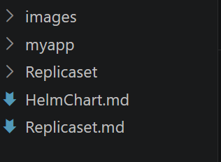

# What is Helm Chart ?
Helm is package manager for Kubernetes, Similar to:
    - apt for ubuntu
    - yum for RHEL
    - npm for Node.js
    - pip for Python
- A helm Chart is a package collection of Kubernetes manifest(YAML files) that can be installed , upgraded or removed as a single unit

## Without Helm
- suppose you want to deploy a WordPress Application
- you might need to create
```
Deployment
Service
ConfigMap
Secret
PersistentVolume
PersistentVolumeClaim
Ingress
HorizontalPodAutoscaler
```
- That's Many YAML files to manage mannually

## With Helm
```
helm install wordpress
```
- helm will automatically create all require resurces of kubernetes togather

## Helm Architecture


## Structure of Helm Chart
```
mychart/

├── Chart.yaml
├── values.yaml
├── charts/
├── templates/
│     ├── deployment.yaml
│     ├── service.yaml
│     ├── ingress.yaml
│     ├── configmap.yaml
│     └── _helpers.tpl
└── README.md
```
## Helm Installation
[Helm Installation](https://helm.sh/docs/intro/install/)
```
HELM_BUILDKITE_APT_KEY_ID="DDF78C3E6EBB2D2CC223C95C62BA89D07698DBC6"

sudo apt-get install curl gpg apt-transport-https --yes

curl -fsSL https://packages.buildkite.com/helm-linux/helm-debian/gpgkey > "${TMPDIR:-/tmp}/helm.gpg"

# Ensure that the key ID matches to prevent a repository compromise from establishing an attacker controlled key
if [ "$(gpg --show-keys --with-colons "${TMPDIR:-/tmp}/helm.gpg" | awk -F: '$1 == "fpr" {print $10}' | head -n 1)" != "${HELM_BUILDKITE_APT_KEY_ID}" ]; then echo "ERROR: Unexpected Helm APT key ID: potential key compromise"; exit 1; fi

cat "${TMPDIR:-/tmp}/helm.gpg" | gpg --dearmor | sudo tee /usr/share/keyrings/helm.gpg > /dev/null
echo "deb [signed-by=/usr/share/keyrings/helm.gpg] https://packages.buildkite.com/helm-linux/helm-debian/any/ any main" | sudo tee /etc/apt/sources.list.d/helm-stable-debian.list

sudo apt-get update
sudo apt-get install helm
```
### Check the Helm Version
```
helm version
```
### Create an Application
```
helm create myapp
```
- it will create myapp folder in your root directory


### Create Deployment, Pod and Service
```
helm install myapp ./myapp/ --debug
```
### Check the output
```
kubectl get deployment
kubectl get pods
kubectl get service
```

### Remove 
```
helm uninstall myapp 
```

--------------------------------------------------------------------------------
## Exercise:1 Deploy nginx Using Helm Chart
--------------------------------------------------------------------------------
Run:
```
helm create nginx-chart
```
Output:
```
nginx-chart/

├── Chart.yaml
├── values.yaml
├── charts/
├── templates/
│   ├── deployment.yaml
│   ├── service.yaml
│   ├── serviceaccount.yaml
│   ├── ingress.yaml
│   ├── hpa.yaml
│   ├── tests/
│   ├── NOTES.txt
│   └── _helpers.tpl
└── .helmignore
```
## Understand Folder Structure
```
chart.yml      -> Chart Information
values.yml     -> User Configurable Values
templates/     -> Kubernetes menifest templates
charts/        -> Dependency charts(Option)
```

## Edit values.yml
```
replicaCount: 2

image:
  repository: nginx
  tag: latest
  pullPolicy: IfNotPresent

service:
  type: ClusterIP
  port: 80
```

## Edit templates/deployment.yml
```
apiVersion: apps/v1
kind: Deployment
metadata:
  name: {{ .Release.Name }}

spec:
  replicas: {{ .Values.replicaCount }}

  selector:
    matchLabels:
      app: {{ .Release.Name }}

  template:
    metadata:
      labels:
        app: {{ .Release.Name }}

    spec:
      containers:
        - name: nginx
          image: "{{ .Values.image.repository }}:{{ .Values.image.tag }}"
          ports:
            - containerPort: 80
```

## Edit templates/service.yml
```
apiVersion: v1
kind: Service
metadata:
  name: {{ .Release.Name }}
 
spec:
  type: {{ .Values.service.type }}
  ports:
    - port: {{ .Values.service.port }}
      targetPort: 80
  selector:
    app: {{.Release.Name }}
  type: {{ .Values.service.type }}

```
## Check your Generated YAML
```
helm template myapp ./nginx-chart
```
- Output:
```
kind: Deployment

metadata:
  name: myapp

spec:
  replicas: 2
```

## Install Chart
```
helm install myapp ./nginx-chart
```
- note: if myapp is already running remove it and re install
## Verify the Deployment
```
kubectl get deployments
```
- Output
```
NAME    READY   UP-TO-DATE   AVAILABLE
myapp     2          2            2
```
## Chekc the Pods
```
kubectl get pods
```
- Output:
```
NAME                     READY   STATUS    RESTARTS      AGE
my-pod                   1/1     Running   1 (23h ago)   25h
myapp-7c5c65b47b-jsgf4   1/1     Running   0             8m8s
myapp-7c5c65b47b-t9wwr   1/1     Running   0             8m8s
nginx-rs-2c9qv           1/1     Running   0             114m
nginx-rs-89pvr           1/1     Running   0             114m
nginx-rs-pfz9q           1/1     Running   0             117m
```
## Check the Service
```
kubectl get svc
```
-----------------------------------------------------------------------------------------
# Exercise:2 Scale the application using Helm
-----------------------------------------------------------------------------------------
- Change: value.yml
```
replicaCount: 5
```
- upgrade the release
```
helm upgrade myapp ./nginx-chart
```
- Verify:
```
kubectl get pods
```
- Output:
```
NAME                     READY   STATUS    RESTARTS      AGE
my-pod                   1/1     Running   1 (23h ago)   25h
myapp-7c5c65b47b-jsgf4   1/1     Running   0             8m8s
myapp-7c5c65b47b-t9wwr   1/1     Running   0             8m8s
myapp-7c5c65b47b-t9xyz   1/1     Running   0             8m8s
myapp-7c5c65b47b-t9pwr   1/1     Running   0             8m8s
myapp-7c5c65b47b-t9wqr   1/1     Running   0             8m8s
```
## Change the Image Version
Update values.yml:
```
image:
  repository: nginx
  tag: 1.27
```
Upgrade:
```
helm upgrade myapp ./nginx-chart
```
## View Release history
```
helm history myapp
```
## Roll Back
If the latest upgrade causes issues:
```
helm rollback myapp 2
```
Helm restores the application to revision 2.

## Uninstall
```
helm unistall myapp
```