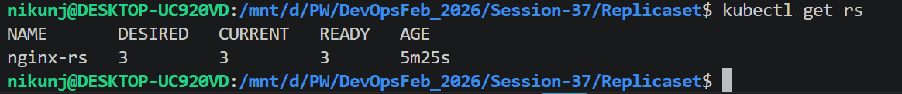
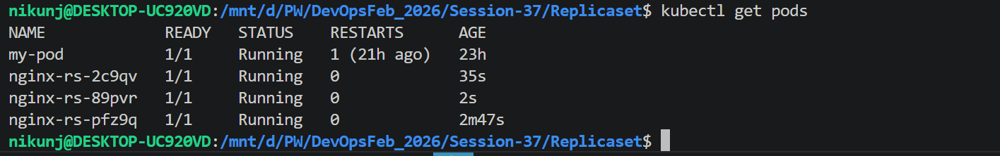
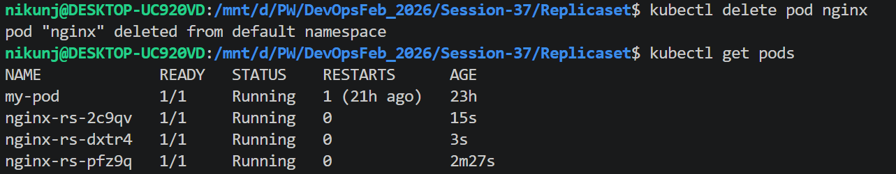

# What is Pod?
    - it is the smallest unit in Kubernetes where cntainers runs
    - if pod dies(crashes) kubernetes doesnot automatically bring it back
# What is Replicaset ?
- A Replicaset ensures that a specified number of identical Pods replicas are always running in th cluster
- if:
    - A pod Crashes: Replicaset Create a New Pod.
    - A pod is deleted: Replicaset Create another Pod
    - You increase replicas: More Pods are Created
    - You Decrease replicas: Extra pods are Removed
## Without ReplicaSet
```
          User
            |
        +--------+
        |  Pod   |
        +--------+

If the Pod crashes ❌

        User
          |
      Application Down
```
## With Replicaset
```
                  ReplicaSet
                      |
      --------------------------------
      |              |              |
   Pod-1          Pod-2          Pod-3

If Pod-2 crashes

                  ReplicaSet
                      |
      -------------------------------
      |              |              |
   Pod-1         Pod-2(X)      Pod-3
                      |
              Creates New Pod
                      |
                 Pod-4 Running
```
- it ensures that desire numbers of pods are always running
### Replicaset YML Example
- replicaset.yml
```
apiVersion: apps/v1
kind: ReplicaSet
metadata:
  name: nginx-rs
  labels:
    app: nginx #match with service selector to redirect the traffic to the pods
spec:
  replicas: 3
  selector:
    matchLabels:
      app: nginx
  template:
    metadata:
      labels:
        app: nginx
    spec:
      containers:
      - name: nginx
        image: nginx:1.14.2
        ports:
        - containerPort: 80

```
- Run Replicaset
```
kubect apply -f replicaset.yml
```
View:

```
kubectl get rs
```

```
kubectl get pod
```

### Now Delete the Pod
```
kubectl delete pod <pod name>
```

Now check the Pods Running, you will see that a new pod is created and total 3 pods will be maintained
```
kubectl get pods
```
