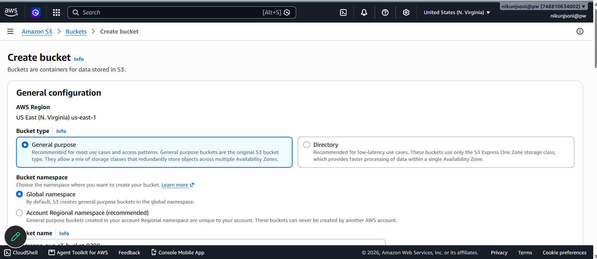
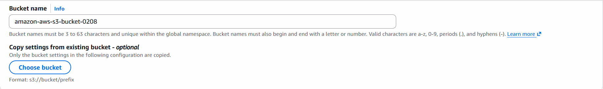
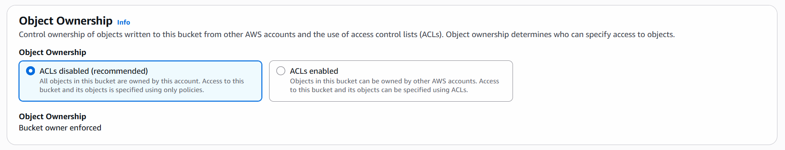
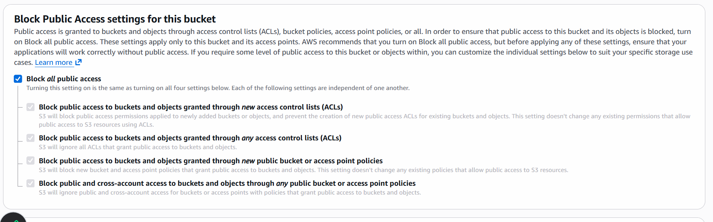
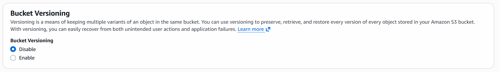
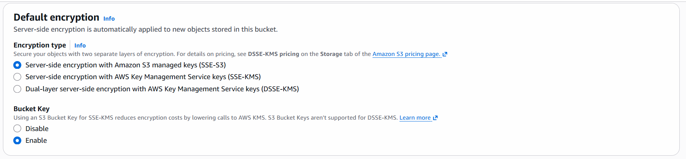
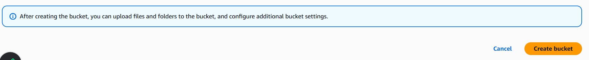
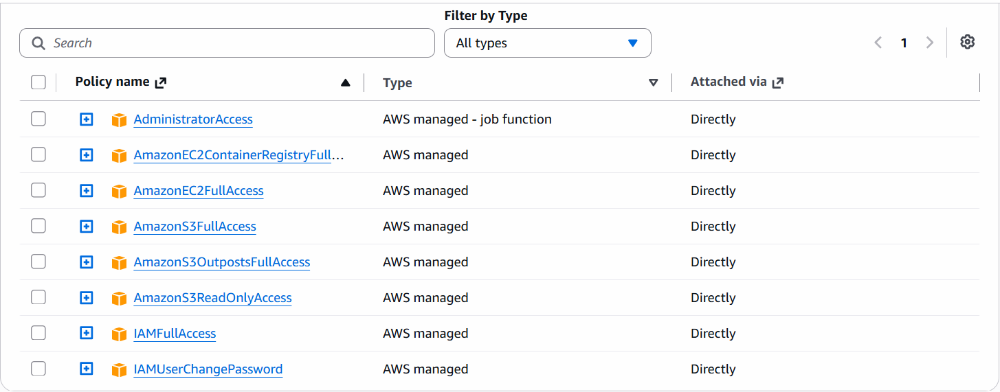

# S3 Bucket
- it is used to store item in aws infrastructure
- we can store directries, audio, video, documents,pdf and all supported extensions related to file system


- Give Unique name









- Create Bucket


## Let's create S3 Bucket Using Terraform
- Attach Below Policies


## Project Structure
```
s3-bucket-terraform
|
|-- main.tf
|
```