# Cloud Watch in AWS
- it is AWS Resource Monitoring Tool
- Suppose you have created an AWS ec2 instance and its CPU Memory Utilization exceeds 70% and Above(Greater tha 70%) in a minute, so it will automatically triggers an alarm and send notification to You on an email
```
EC2 Instance
   │
   │ CPU Utilization
   ▼
CloudWatch
   │
   │ CPU > 70%
   ▼
CloudWatch Alarm
   │
   ▼
SNS
   │
   ▼
Email
```
## Step by Step Guide to Create AWS CloudWatch Alarm
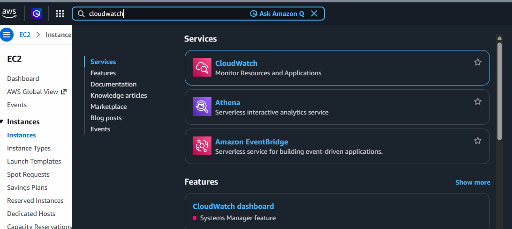

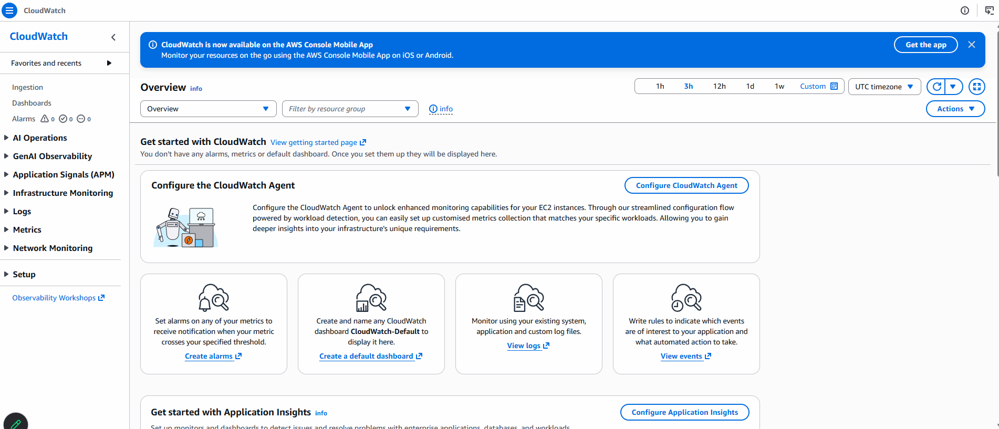

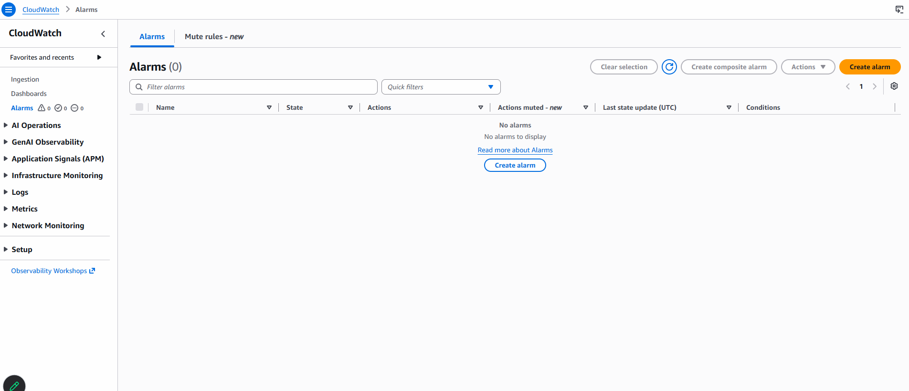

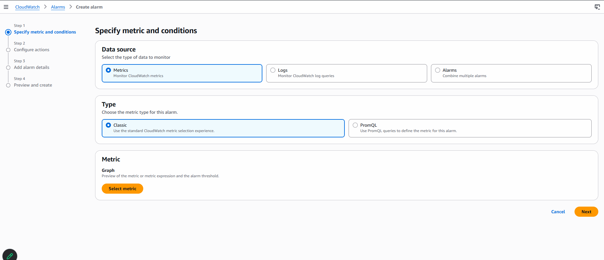

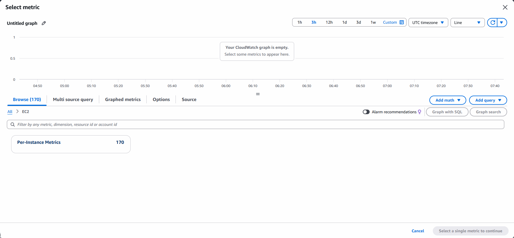

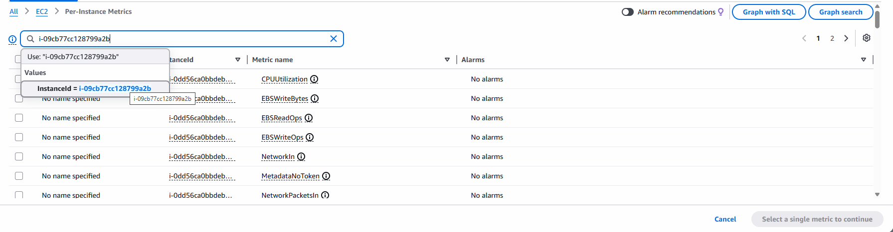

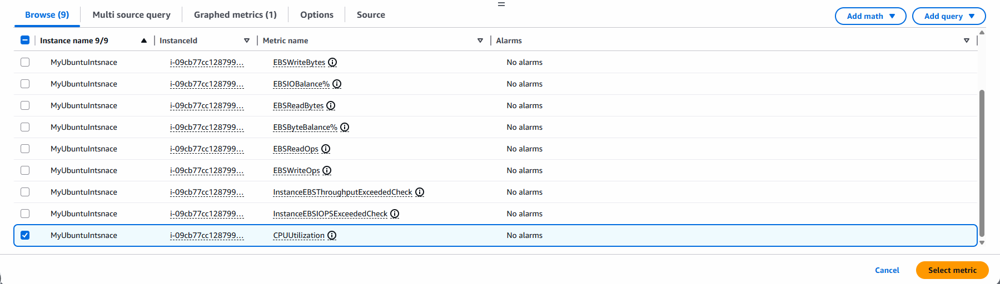

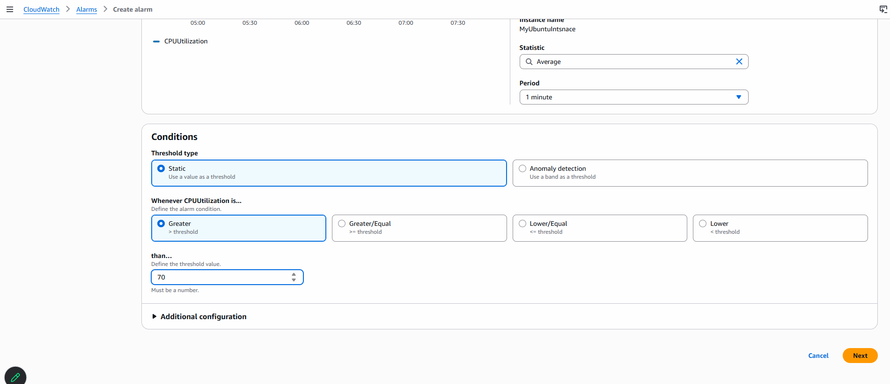

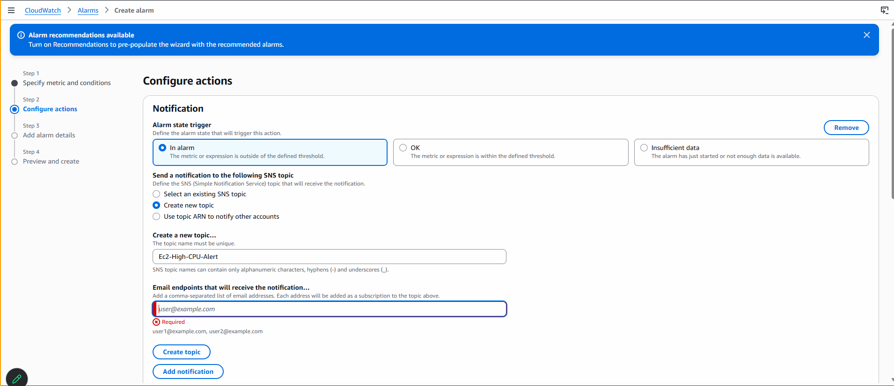

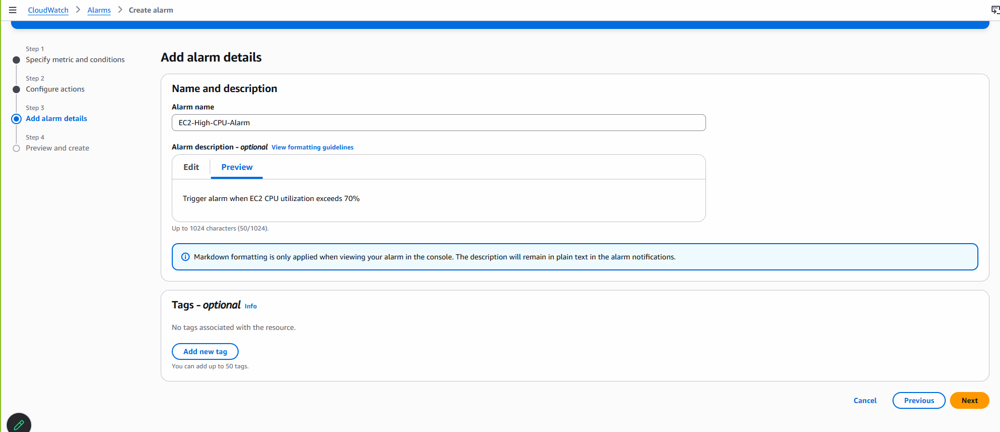

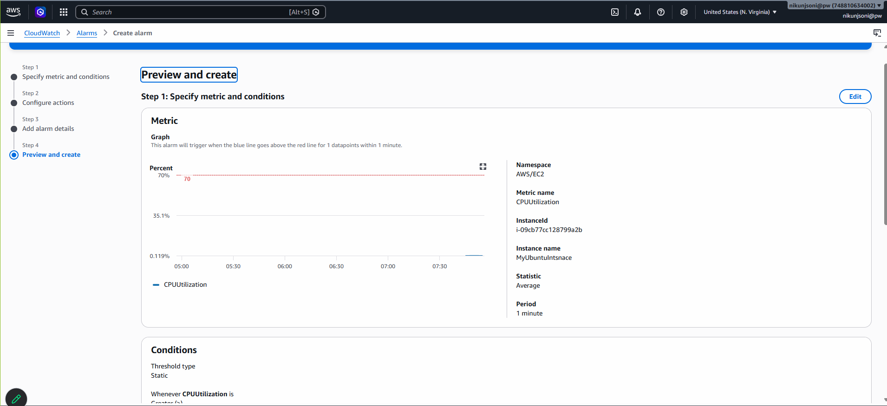

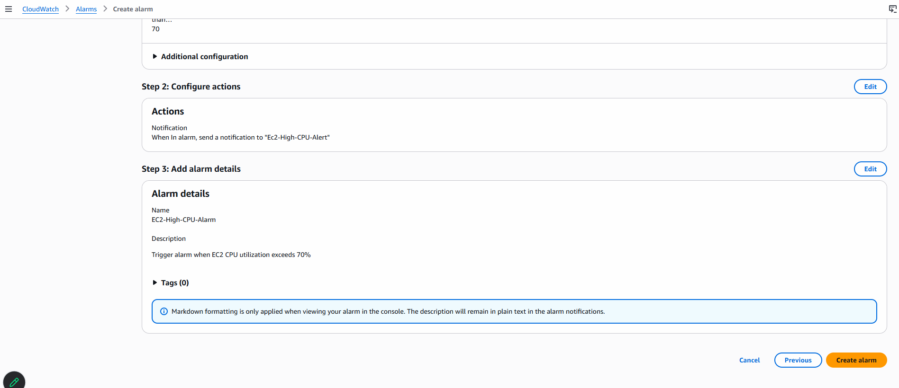

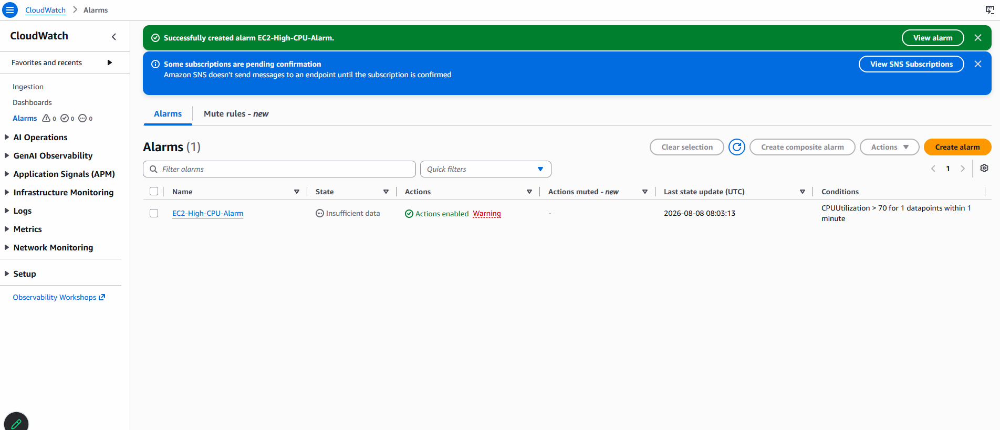

- confirm the Subscription in EMAIL(Check Spam Folder)
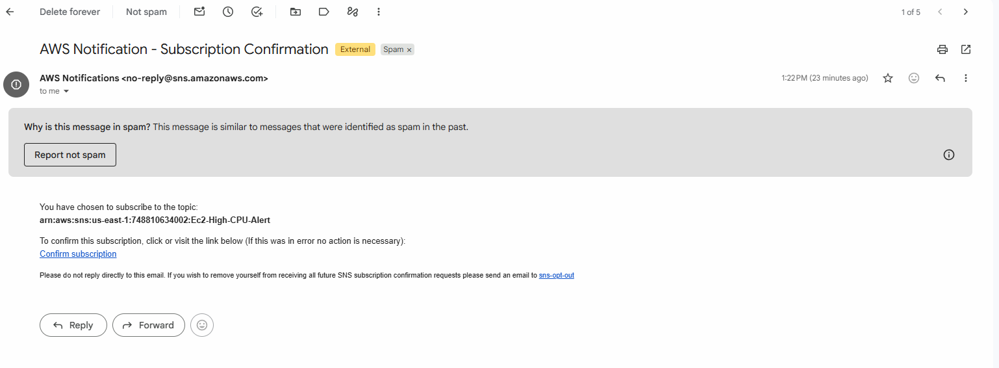

## Shootout the CPU Utilization
- Connect Your EC2 Instance

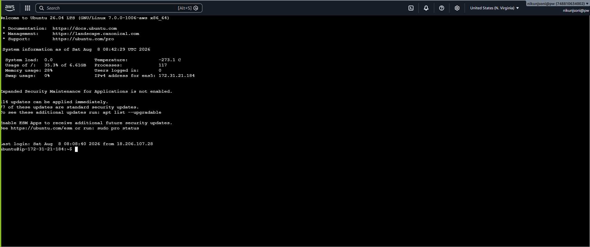

- let's install Load on EC2 Instance
```
sudo apt update
```
```
sudo apt install stress-ng -y
```
```
stress-ng --version
```
- Generate Load - This will use 2 CPU workers for 5 minutes.
```
stress-ng --cpu 2 --timeout 5m
```
- If your EC2 has only 1 vCPU, use:
```
stress-ng --cpu 1 --timeout 5m
```
- Goto> CloudWatch>Your Alarm
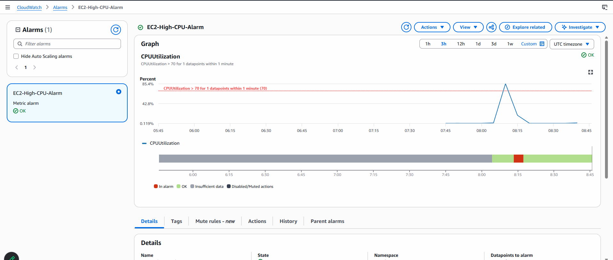
- Now Monitor it for 5 Minutes
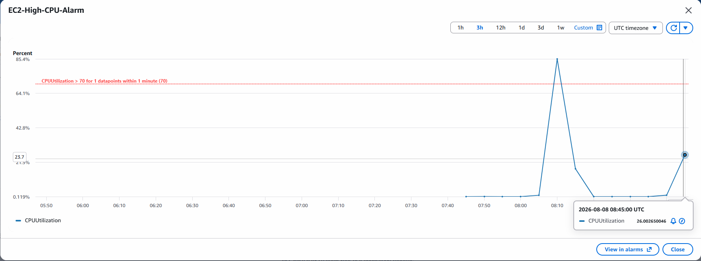
- From 'OK(Green)' to 'Alarm(Red)' it will Change
- 
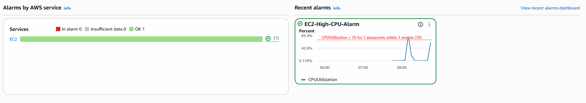

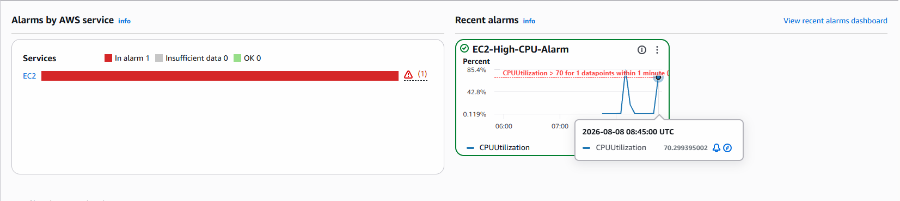

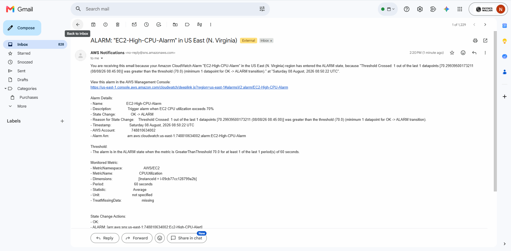

- once load will be free Graph Automatically Goes Down
  
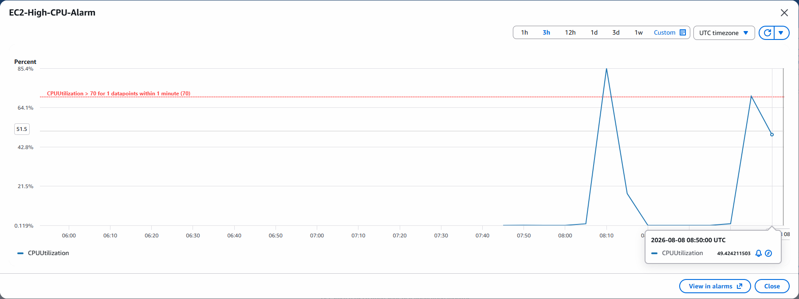

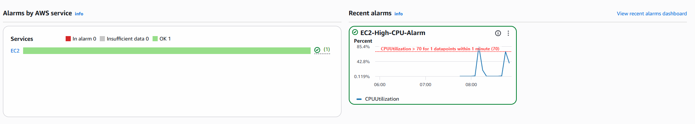

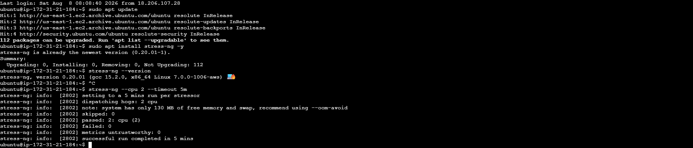

----------------------------------------------------------------------------------------------------

# Create CloudWatch Alarm Using Terraform
- we will reproduce the same manual CloudWatch demo using Terraform

## Setup
```
Terraform
   │
   ├── EC2 Ubuntu
   │      └── stress-ng installed
   │
   ├── SNS Topic
   │      └── Email subscription
   │
   └── CloudWatch Alarm
          │
          └── CPU > 70% for 2 minutes
                    │
                    ▼
                  SNS
                    │
                    ▼
                  Email
```
## Project Structure
```
terraform-cloudwatch-demo/
│
├── provider.tf
├── variables.tf
├── terraform.tfvars
├── main.tf
└── outputs.tf
```