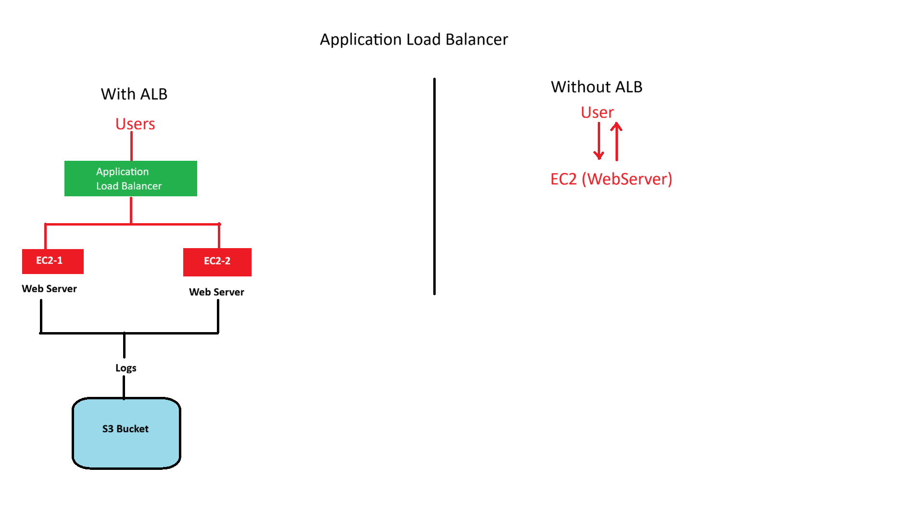

# Application Load Balanacer

```
Two EC2 servers
Servers should be in different Availability Zones
Both servers should run Apache HTTP Server
Application Load Balancer should distribute traffic
If EC2-1 fails, traffic should go to EC2-2
ALB should perform health checks
ALB access logs should be stored in S3
CloudWatch should collect EC2 logs
Everything should eventually be automated using Terraform
```
## First Understand This
```
                         INTERNET
                             |
                             |
                    +----------------+
                    |      ALB       |
                    | Port 80        |
                    +----------------+
                       /          \
                      /            \
                     /              \
             +-------------+   +-------------+
             |    EC2-1    |   |    EC2-2    |
             | HTTP : 80   |   | HTTP : 80   |
             +-------------+   +-------------+
                    |                 |
                    +--------+--------+
                             |
                          VPC
                       10.0.0.0/16

             +---------------------------+
             |       S3 Bucket            |
             |       ALB Logs             |
             +---------------------------+

             +---------------------------+
             |       CloudWatch           |
             |       EC2 Logs             |
             +---------------------------+
```
