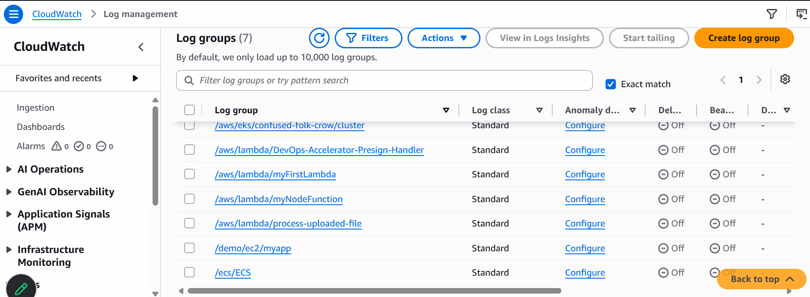
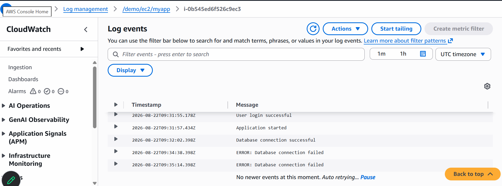

# Real-life scenario

Imagine you work for an e-commerce company:
```
Customer
   │
   ▼
Website / API
   │
   ▼
EC2 Server
   │
   ├── Application
   │
   └── /var/log/myapp/app.log
```
You Applicatin might Generate:
```
INFO  User 123 logged in
INFO  Order 9876 created
ERROR Database connection failed
ERROR Payment service unavailable
WARN  High response time
```
Now imagine there are 50 EC2 servers.

You don't want a DevOps engineer to SSH into every server and run:
```
cat /var/log/myapp/app.log
```
# So What is the Solution Then?
## Solution is
```
              50 EC2 Servers
                    │
                    │ CloudWatch Agent
                    ▼
        ┌──────────────────────┐
        │   CloudWatch Logs    │
        └──────────┬───────────┘
                   │
          ┌────────┴────────┐
          ▼                 ▼
       Search             Alerts
       Logs              / Alarms
```

## Step:1 Create an EC2 Instance
Go to:
__AWS Console--> EC2-->Instance--> Launch Instance__

__Name:__
```
secure-log-monitoring
```
__AMI:__
```
Linux
```
__Instnace Type:__
```
t3.micro(Free Tier Eliglible)
```
__Key Pair:__
```
secure-log-key
```
__Network:__
```
For a Basic Lab, default one is fine
```
__Security Group:__
```
TCP
SSH
22
MYIP
```
use default one only

## Step:2 Create IAM Role
__AWS Console → IAM → Roles → Create role__
Select:
```
Trusted entity type:
AWS service
```
Select:
```
Service or use case:
EC2
```
Attach Cloud Watch Permission
```
CloudWatchAgentServerPolicy
```
Give the role Name
```
EC2-Cloudwatch-Role
```

## What this will do?
```
EC2
 │
 │ needs permission
 ▼
IAM Role
 │
 ▼
CloudWatchAgentServerPolicy
 │
 ▼
Permission to interact with CloudWatch
```

## Step:3 Attach the IAM Role to EC2
__EC2 → Instances → your instance → Actions → Security → Modify IAM Role__

Select:
```
EC2-Cloudwatch-Role
```
Click
```
Update IAM role
```
## Step:4 Connect EC2 Instance(Remotely or Web)
check the os:
```
cat /etc/os-release
```
also
```
whoami
```
## Step: 5 Install Cound Watch Agent
```
sudo yum install amazon-cloudwatch-agent
```
if prompted:
```
Is this ok [y/d/N]:
``` 
type:
```
y
```
## Step:6 Create our Application log Directory
```
sudo mkdir /var/log/myapp
```
create ```app.log``` file
```
sudo touch /var/log/myapp/app.log
```
Verify
```
ls -l /var/log/myapp
```
now you will see
```
app.log
```

## Step:7 Generate a Test Log
```
echo "Test Log" | sudo tee -a /var/log/myapp/app.log
```
verify:
```
cat /var/log/myapp/app.log
```
```
echo "Test Log-1" | sudo tee -a /var/log/myapp/app.log
```
verify:
```
cat /var/log/myapp/app.log
```
## Step:8 Configure CloudWatch Agent
```
sudo nano /opt/aws/amazon-cloudwatch-agent/etc/amazon-cloudwatch-agent.json
```
add this to the file
```
{
    "logs": {
        "logs_collected": {
            "files": {
                "collect_list": [
                    {
                        "file_path": "/var/log/myapp/app.log",
                        "log_group_name": "/demo/ec2/myapp",
                        "log_stream_name": "{instance_id}"
                    }
                ]
            }
        }
    }
}
```
Save: ctr+c
Exit: ctr+x

Validate:
```
python3 -m json.tool /opt/aws/amazon-cloudwatch-agent/etc/amazon-cloudwatch-agent.json
```
Verify Configuration
```
cat /opt/aws/amazon-cloudwatch-agent/etc/amazon-cloudwatch-agent.json
```

## Step:9 Start Cloud Watch Agent
```
sudo /opt/aws/amazon-cloudwatch-agent/bin/amazon-cloudwatch-agent-ctl \
-a start \
-c file:/opt/aws/amazon-cloudwatch-agent/etc/amazon-cloudwatch-agent.json \
-m ec2
```
check the agent status:
```
sudo /opt/aws/amazon-cloudwatch-agent/bin/amazon-cloudwatch-agent-ctl -a status
```
output:
```
{
  "status": "running",
  "starttime": "2026-08-22T09:18:01+00:00",
  "configstatus": "configured",
  "version": "1.300069.1"
}
```

## Step:10 Generate Test Logs
```
echo "FINAL SUCCESS TEST $(date)" | sudo tee -a /var/log/myapp/app.log
```
```
echo "User login successful" | sudo tee -a /var/log/myapp/app.log
```
```
echo "Application Started" | sudo tee -a /var/log/myapp/app.log
```
```
echo "Application started" | sudo tee -a /var/log/myapp/app.log
```

## Step:11 Open CloudWatch
Go to: ClouWatch>view logs>

You will see the folder with: ```/demo/ec2/myapp```
click on it and open the logs

--------------------------------------------------------------------------

# Let's do the same using Terrform