# Elastic Block Storage (EBS)
- in this lab we will understand to Attach, Create, Format, Mount, Test, Unmount,Remove,Detach The AMAZON EBS Volume on an EC2 Linux Instance

# Step:1 Create AWS EC2 Instance
instance Details:
- EC2 instance: Linux
- Root Disk: 8GB
- Availability Zoni: us-east-1a (it should be same for all)

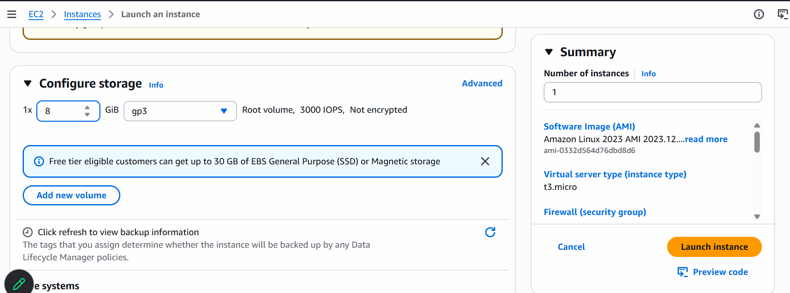

- wait till status checks completed to ```3/3 checks passed```
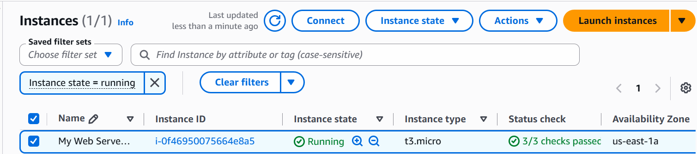

- Connect using AWS CLI
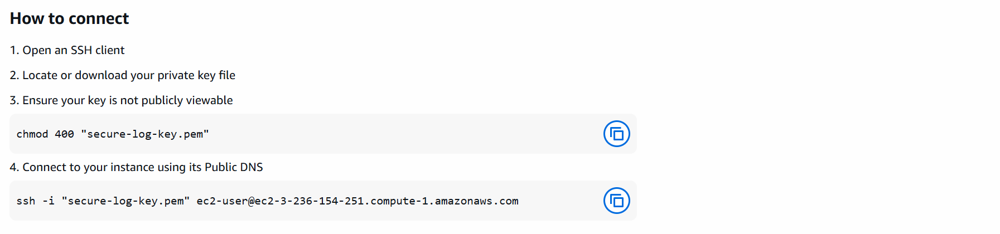

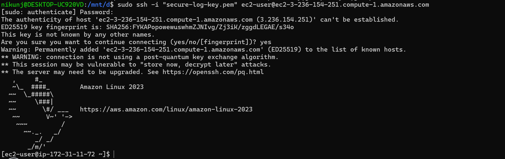
- Get the List of Available Disk
```
lsblk
```
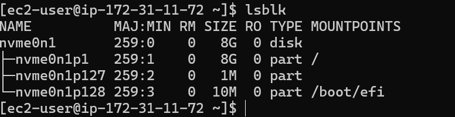

## Step:2 Create Elastic Block Storage Volume(EBS Volume)
- Go to: left Navigation Menu> EBS> Volumes

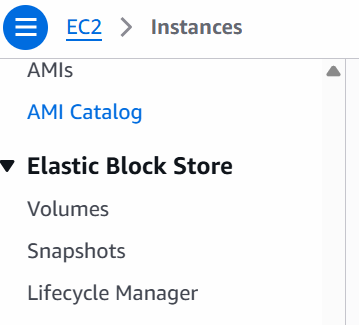

- Click on ```Create Volume```
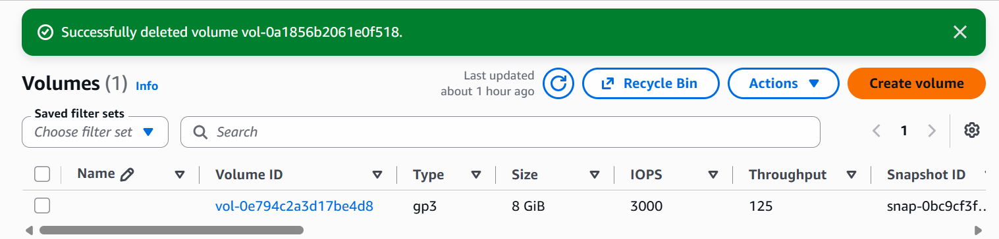

- Choose This Setting

    1. Volume Type: gp3
    2. Size: 1 Gib
    3. Availability Zone: us-east-1a (Must Be Same as your EC2 Instance)

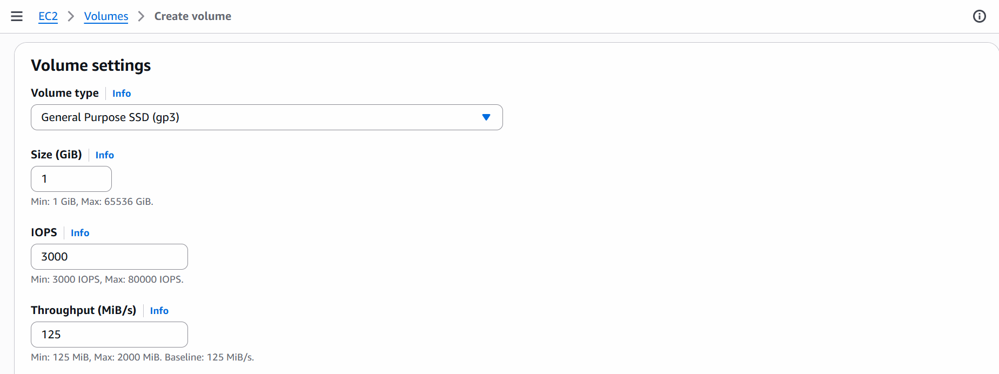

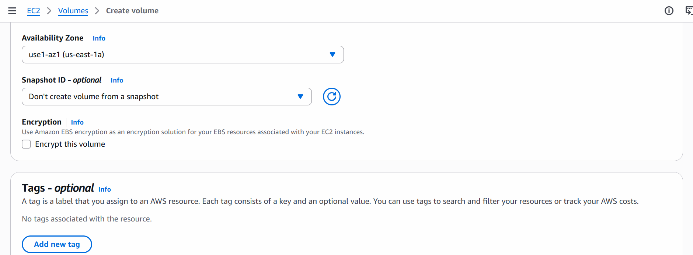

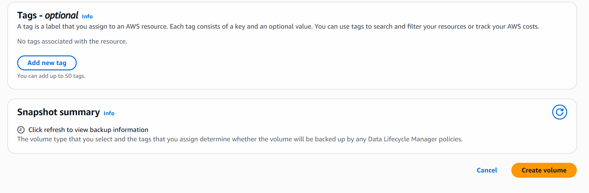

## Step:3 Attach EBS Volume to EC2
__Note:__ Make Sure Your EC2 Instance and EBS volume Must be in a Same AZ's, if they are in different AZ, You Won't be able to Attach the Volume to EC2 Instance

- click on Volume > Action > Attach Volume
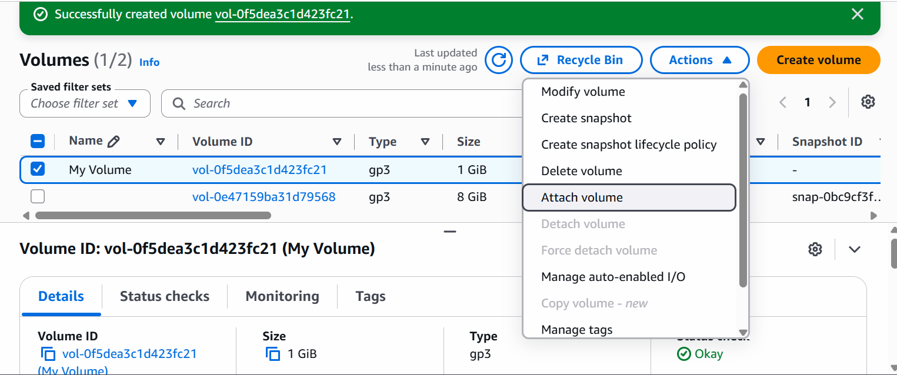

- choose your instance
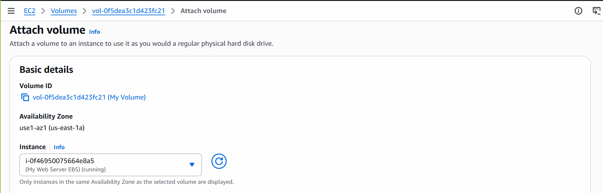

- choose device name
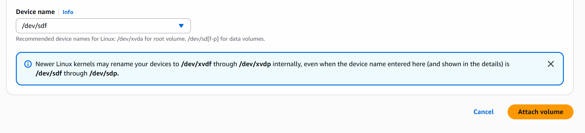

- goto> EC2 Instance> Storage>
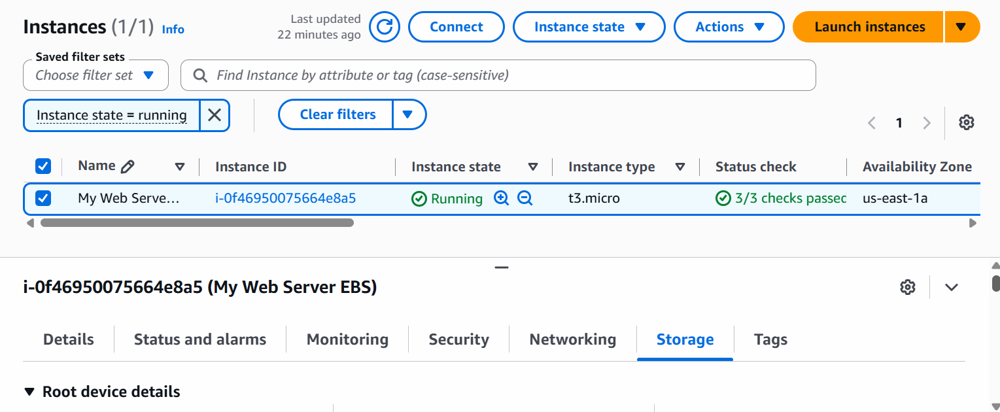

- scroll down and check the list of EBS, You will see the newly added EBS
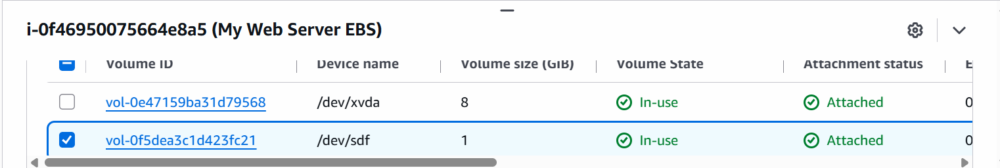

- check using AWS CLI
```
lsblk
```
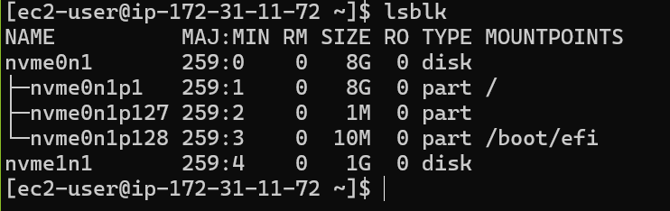

## Step:4 Format the EBS Volume

- Format it with ```ext4``` filesystem:
```
sudo mkfs -t ext4 /dev/nvme1n1
```
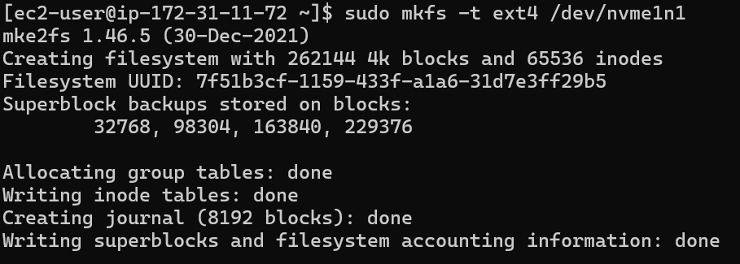

verify the Filesystem
```
lsblk -f
```

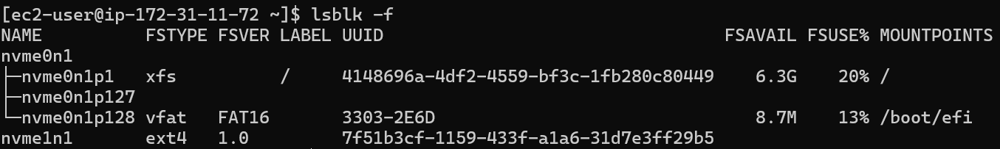

## Step:5 Create a Mount Point
- Create a directory called ```/data```

```
sudo mkdir /data
```

- Mount The EBS Volume

```
sudo mount /dev/nvme1n1 /data
```
- verify the mount with:
```
df -h
```
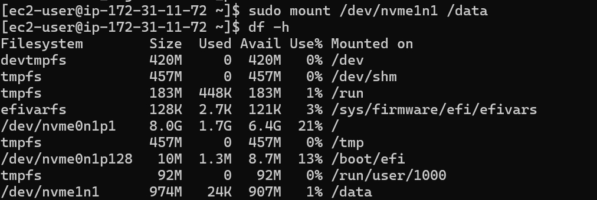

- output
```
/dev/nvme1n1      974M   24K   907M   1%   /data
```

## Step:6 Test the EBS Volume
- create a test file on the mounted EBS Volume
```
echo "Hello From EBS" | sudo tee /data/test.txt
```
- Read the file
```
cat /data/test.txt
```
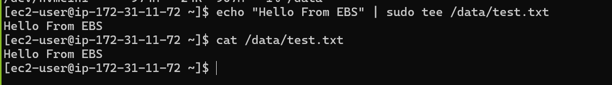

## Step:7 Unmount Disk
```
sudo umount /data
```
Now Try to Read Data
```
cat /data/test.txt
```
Output:
```
cat: /data/test.txt: No such file or directory
```
## Step:8 Mount The Disk
```
sudo mount /dev/nvme1n1 /data
```
Now Try to Read Data
```
cat /data/test.txt
```