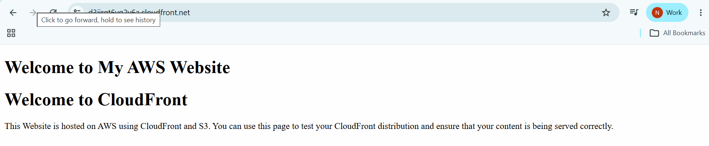
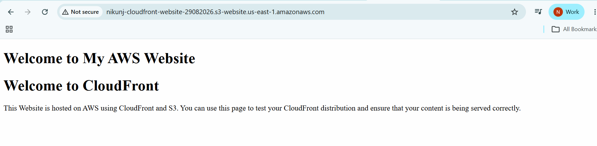

# CloudFront Static Web Hosting

```
Terraform
|
|-----S3 bucket
|
|-----S3 bucket Policy
|
|-----index.html
|
|-----Static Web Hosting
|
|-----CloudFront Distribution
|
|-----CloudFront Domain Output

```

# Final Plan
```
                    Terraform
                        |
         +--------------+--------------+
         |              |              |
         v              v              v
       S3          S3 Website      S3 Policy
         |          Config
         |
         v
    index.html
         |
         +---------------+
                         |
                         v
                   CloudFront
                         |
                         v
                    Distribution
```

# Output
```
cloudfront_domain_name = "d3jirqt6yg2y6a.cloudfront.net"
s3_bucket_name = "nikunj-cloudfront-website-29082026"
s3_website_endpoint = "nikunj-cloudfront-website-29082026.s3-website-us-east-1.amazonaws.com"
```

# Open Website using CloudFront
```
d3jirqt6yg2y6a.cloudfront.net
```
# Open Website using S3 Bucket
```
http:/<yourbucketname>.s3-website.<your_availablity_zone>.amazonaws.com/
```
Eg:
```
http://nikunj-cloudfront-website-29082026.s3-website.us-east-1.amazonaws.com/
```


