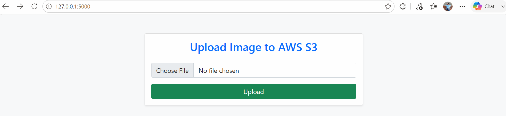
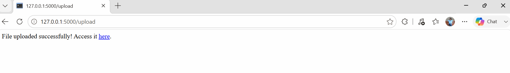
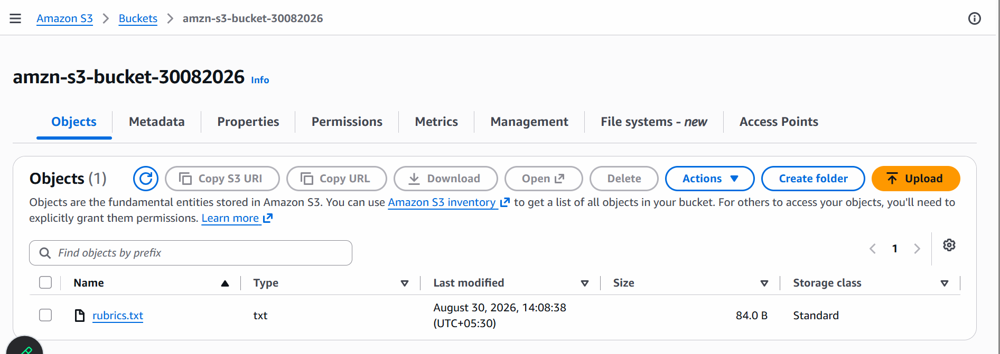

# Image Upload Application 
- Here we will upload an image from ```index.html``` to ```S3bucket``` using ```Python Flask API```
## Project Structure
```
flask-s3-terraform
|
|---main.tf
|
|---variable.tf
|
|---outputs.tf
|
|---user_data.sh.tpl (index.html)
|
|---app.py(python Flask API)
|
|---requirements.txt(frameworks/dependencies to be installed)

```
# Step:1 Create Index.html
```
<!DOCTYPE html>
<html lang="en">
<head>
    <meta charset="UTF-8">
    <meta name="viewport" content="width=device-width, initial-scale=1.0">
    <title>Document</title>
    <link href="https://cdn.jsdelivr.net/npm/bootstrap@5.0.2/dist/css/bootstrap.min.css" rel="stylesheet" integrity="sha384-EVSTQN3/azprG1Anm3QDgpJLIm9Nao0Yz1ztcQTwFspd3yD65VohhpuuCOmLASjC" crossorigin="anonymous">
</head>
<body class="bg-light">
    <div class="container mt-5">
        <div class="row justify-content-center">
            <div class="col-md-6">
                <div class="card shadow-sm">
                    <div class="card-body text-center">
                       <h3 class="text-center text-primary mb-4">Upload Image to AWS S3</h3>
                       <form action="/upload" method="post" enctype="multipart/form-data">
                            <div class="mb-3">
                                <input type="file" class="form-control" name="file" required>
                            </div>
                            <button type="submit" class="btn btn-success w-100">Upload</button>
                        </form>
                    </div>
                </div>
            </div>
        </div>
<script src="https://cdn.jsdelivr.net/npm/@popperjs/core@2.9.2/dist/umd/popper.min.js" integrity="sha384-IQsoLXl5PILFhosVNubq5LC7Qb9DXgDA9i+tQ8Zj3iwWAwPtgFTxbJ8NT4GN1R8p" crossorigin="anonymous"></script>
<script src="https://cdn.jsdelivr.net/npm/bootstrap@5.0.2/dist/js/bootstrap.min.js" integrity="sha384-cVKIPhGWiC2Al4u+LWgxfKTRIcfu0JTxR+EQDz/bgldoEyl4H0zUF0QKbrJ0EcQF" crossorigin="anonymous"></script>
</body>
</html>
```

## Step:2 Create Flask APP
```app.py```
```
from flask import Flask,render_template_string,request
import boto3
import os
#sudo apt install python3 python3-flask python3-boto3
app = Flask(__name__)

#S3_BUCKET = os.environ.get('S3_BUCKET')
#amzn-s3-bucket-30082026
S3_BUCKET = "amzn-s3-bucket-30082026"  # Change this to your S3 bucket name
S3_REGION = "us-east-1"  # Change this to your S3 bucket's region
s3=boto3.client('s3', region_name=S3_REGION)
HTML_FORM='''
<!DOCTYPE html>
<html lang="en">
<head>
    <meta charset="UTF-8">
    <meta name="viewport" content="width=device-width, initial-scale=1.0">
    <title>Document</title>
    <link href="https://cdn.jsdelivr.net/npm/bootstrap@5.0.2/dist/css/bootstrap.min.css" rel="stylesheet" integrity="sha384-EVSTQN3/azprG1Anm3QDgpJLIm9Nao0Yz1ztcQTwFspd3yD65VohhpuuCOmLASjC" crossorigin="anonymous">
</head>
<body class="bg-light">
    <div class="container mt-5">
        <div class="row justify-content-center">
            <div class="col-md-6">
                <div class="card shadow-sm">
                    <div class="card-body text-center">
                       <h3 class="text-center text-primary mb-4">Upload Image to AWS S3</h3>
                       <form action="/upload" method="post" enctype="multipart/form-data">
                            <div class="mb-3">
                                <input type="file" class="form-control" name="file" required>
                            </div>
                            <button type="submit" class="btn btn-success w-100">Upload</button>
                        </form>
                    </div>
                </div>
            </div>
        </div>
<script src="https://cdn.jsdelivr.net/npm/@popperjs/core@2.9.2/dist/umd/popper.min.js" integrity="sha384-IQsoLXl5PILFhosVNubq5LC7Qb9DXgDA9i+tQ8Zj3iwWAwPtgFTxbJ8NT4GN1R8p" crossorigin="anonymous"></script>
<script src="https://cdn.jsdelivr.net/npm/bootstrap@5.0.2/dist/js/bootstrap.min.js" integrity="sha384-cVKIPhGWiC2Al4u+LWgxfKTRIcfu0JTxR+EQDz/bgldoEyl4H0zUF0QKbrJ0EcQF" crossorigin="anonymous"></script>
</body>
</html>
'''
@app.route('/')
def home():
    return render_template_string(HTML_FORM)
@app.route('/upload', methods=['POST'])
def upload():
    file=request.files['file']
    if file:
        s3.upload_fileobj(file, S3_BUCKET, file.filename)
        url=f"https://{S3_BUCKET}.s3.{S3_REGION}.amazonaws.com/{file.filename}"
        return f"File uploaded successfully! Access it <a href='{url}' target='_blank'>here</a>."
    return "No file selected for uploading."    

if __name__ == '__main__':
    app.run(debug=True)
```
## Step:3 Create AWS S3 Bucket
- add bucket policy
```
{
    "Version": "2012-10-17",
    "Statement": [
        {
            "Sid": "Statement1",
            "Effect": "Allow",
            "Principal": "*",
            "Action": [
                "s3:PutObject",
                "s3:GetObject"
            ],
            "Resource": "arn:aws:s3:::amzn-s3-bucket-30082026/*"
        }
    ]
}
```

- copy the bucket name and add it on ```app.py```
```
S3_BUCKET = "amzn-s3-bucket-30082026"  # Change this to your S3 bucket name
```
## Step:4 Install The Dependencies
```
sudo apt install python3 python3-flask python3-boto3
```

## Step:5 Run Falsk APP
```
python3 app.py
```


