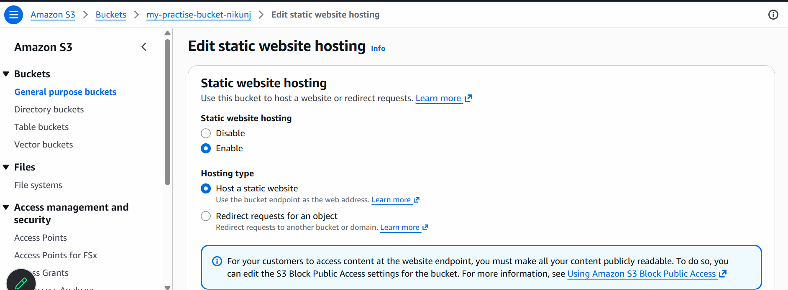
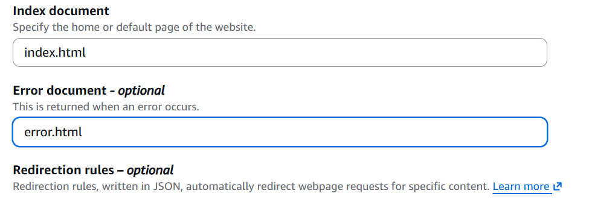
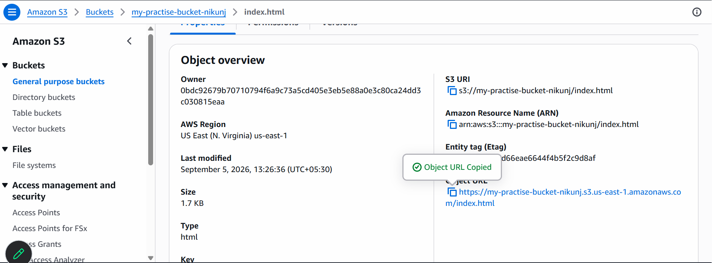
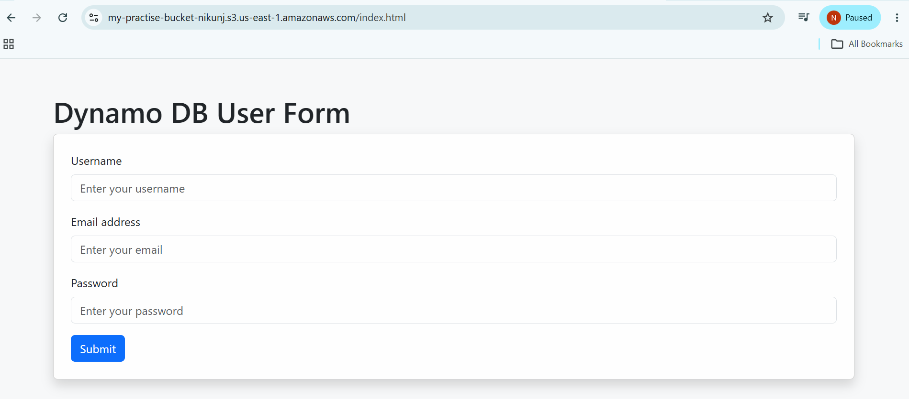

# Static Web Hosting on S3 Bucket

- in this tutorial we will learn how to deploy an index.htm file(website) to deploy on s3 bucket
- Create ```index.html``` file

```
<!doctype html>
<html lang="en">

<head>
    <meta charset="utf-8">
    <meta name="viewport" content="width=device-width, initial-scale=1">
    <title>Dynamo DB User Form</title>
    <link href="https://cdn.jsdelivr.net/npm/bootstrap@5.3.8/dist/css/bootstrap.min.css" rel="stylesheet"
        integrity="sha384-sRIl4kxILFvY47J16cr9ZwB07vP4J8+LH7qKQnuqkuIAvNWLzeN8tE5YBujZqJLB" crossorigin="anonymous">
</head>

<body class="bg-light">

    <div class="container mt-5">
        <h1>Dynamo DB User Form</h1>
        <div class="card shadow p-4">
            <form action="/submit" method="post">
                <div class="mb-3">
                    <label for="username" class="form-label">Username</label>
                    <input type="text" class="form-control" id="username" placeholder="Enter your username">
                </div>
                <div class="mb-3">
                    <label for="email" class="form-label">Email address</label>
                    <input type="email" class="form-control" id="email" placeholder="Enter your email">
                </div>
                <div class="mb-3">
                    <label for="password" class="form-label">Password</label>
                    <input type="password" class="form-control" id="password" placeholder="Enter your password">
                </div>
                <button type="submit" class="btn btn-primary ">Submit</button>
            </form>
        </div>
    </div>

    <script src="https://cdn.jsdelivr.net/npm/bootstrap@5.3.8/dist/js/bootstrap.bundle.min.js"
        integrity="sha384-FKyoEForCGlyvwx9Hj09JcYn3nv7wiPVlz7YYwJrWVcXK/BmnVDxM+D2scQbITxI"
        crossorigin="anonymous"></script>
</body>

</html>
```

- Create ```error.html``` file

```
<!doctype html>
<html lang="en">

<head>
    <meta charset="utf-8">
    <meta name="viewport" content="width=device-width, initial-scale=1">
    <title>Dynamo DB User Form</title>
    <link href="https://cdn.jsdelivr.net/npm/bootstrap@5.3.8/dist/css/bootstrap.min.css" rel="stylesheet"
        integrity="sha384-sRIl4kxILFvY47J16cr9ZwB07vP4J8+LH7qKQnuqkuIAvNWLzeN8tE5YBujZqJLB" crossorigin="anonymous">
</head>

<body class="bg-light">

    <div class="container mt-5">
        <h1>There is an Error</h1>
        <div class="card shadow p-4">
            <p class="text-danger">An unexpected error occurred. Please try again later.</p>
            <a href="/" class="btn btn-primary mt-3">Go Back to Form</a>
        </div>
    </div>

    <script src="https://cdn.jsdelivr.net/npm/bootstrap@5.3.8/dist/js/bootstrap.bundle.min.js"
        integrity="sha384-FKyoEForCGlyvwx9Hj09JcYn3nv7wiPVlz7YYwJrWVcXK/BmnVDxM+D2scQbITxI"
        crossorigin="anonymous"></script>
</body>

</html>
```

## Create S3 Bucket Using AWS CLI
```
aws s3 mb s3://my-practise-bucket-nikunj
```

## Uplad file to s3 Bucket
```
aws s3 cp <file.ext> s3://my-practise-bucket-nikunj/
```
- upload index.html,error.html file and other resources

## List the aws s3 buckets
```
aws s3 list
```

## Enable Web Hosting on S3 bucket





## Make s3 Object Public
```
aws s3api put-object-acl \
  --bucket my-practise-bucket-nikunj \
  --key index.html \
  --acl public-read
```

## Add Bucket Policy
- Create ```policy.json``` file
- add the below policy in it

```
{
  "Version": "2012-10-17",
  "Statement": [
    {
      "Effect": "Allow",
      "Principal": "*",
      "Action": "s3:GetObject",
      "Resource": "arn:aws:s3:::my-practise-bucket-nikunj/*"
    }
  ]
}
```
- run the below command
```
aws s3api get-public-access-block \
  --bucket my-practise-bucket-nikunj
```
```
aws s3api put-public-access-block \
  --bucket my-practise-bucket-nikunj \
  --public-access-block-configuration \
  BlockPublicAcls=false,IgnorePublicAcls=false,BlockPublicPolicy=false,RestrictPublicBuckets=false
```
```
aws s3api put-bucket-policy \
  --bucket my-practise-bucket-nikunj \
  --policy file://policy.json

```

## Bucket Versioning Enabled
```
aws s3api put-bucket-versioning \
    --bucket my-practise-bucket-nikunj \
    --versioning-configuration Status=Enabled
```
- Verify:
```
aws s3api get-bucket-versioning \
    --bucket my-practise-bucket-nikunj
```
- output:
```
{
    "Status": "Enabled"
}
```
## Enebale Server Side Encryption
```
aws s3api put-bucket-encryption \
    --bucket my-practise-bucket-nikunj \
    --server-side-encryption-configuration \
    '{"Rules":[{"ApplyServerSideEncryptionByDefault":{"SSEAlgorithm":"AES256"}}]}'
```
- Verify:
```
aws s3api get-bucket-encryption \
    --bucket my-practise-bucket-nikunj
```

## Open S3 Bucket 



