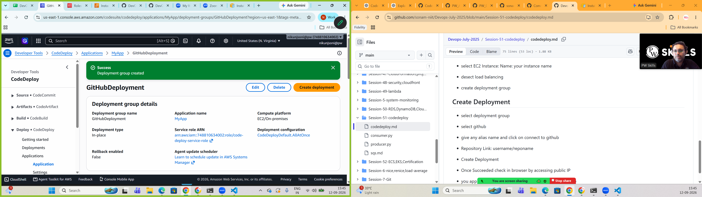
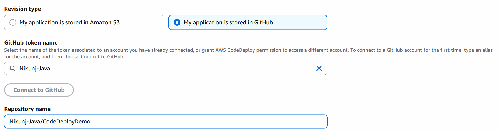
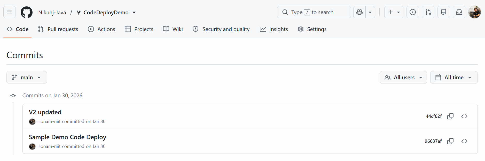
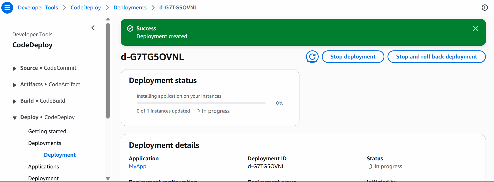

# Code Deploy
```
GitHub /GithubAction
 ↓
CodeDeploy
 ↓
Ec2 Instance Deploy
```
## Step:1 Create EC2 Instance and Install Code Deploy
- Create Ubuntu Instance
- Open Port 80 and 5000
## Step:2 Create Role for EC2 Code Deploy
- 1. Create a New Role
```
I AM--> Create Role---> AWS Service--->Select EC2--->ServiceRoleEc2CodeDeploy
```
- 2. Attach Policies
```
AWSCodeDeployRole
AWSCodeDeployFullAccess
AmazonS3ReadOnlyAccess
```
- Create The Role
## Step:3 Attach Role to EC2 Instance
- EC2 Instance---> Action--->Security--->Modify IAM Role--> Attach the role "ServiceRoleEc2CodeDeploy"

## Step:4 Install CodeDeploy on EC2 Instance
[Code Deploy Docs](https://docs.aws.amazon.com/codedeploy/latest/userguide/codedeploy-agent-operations-install-ubuntu.html)

- update the system
```
sudo apt update
```
- Upgrade the system
```
sudo apt upgrade -y
```
- Install wget
```
sudo apt install wget -y
```
- move to home directory
```
cd /home/ubuntu
```
- get the present working directory
```
pwd
```
- if any previous installer is available remove it
```
rm -f install
```
- download the new installer
```
wget https://aws-codedeploy-ap-south-1.s3.ap-south-1.amazonaws.com/latestv2/install
```
- Check
```
ls -l install
```
- Make it executable
```
chmod +x ./install
```
- Install Code Deploy Agent
```
sudo ./install auto
```
- Check the Status
```
sudo systemctl status codedeploy-agent
```
## Step:5 Create Code Deploy Application
- Goto> CodeDeploy> Create Application> Name: MyApp
- Platform
```
EC2- On Premises
```
- Create The Application

## Step:6 Create Service Role
- Goto> IAM>Create Role>AWS Service>
Use Case:
```
Code Deploy
```
Choose
```
CodeDeploy
```
- It Will Automatically Create Permission : AWSCodeDeployRole
- Give The Name:  code-deploy-service-role

Click - Create Role
## Step:7 Create Deployment Group
Click On Create Deployment Group
- Give The Name:GitHubDeployment
- choose the Service Role That You Have Created ins Step:6
Search for
```
code-deploy-service-role
```
Deployment Type:
```
in place
```
Environment configuration
Choose:
```
Amazon EC2 Instance
```
Tags
Key:  Name
Value: your ec2 instance name eg: code-deploy-demo

Load Balancer
```
Uncheck the Checkbox as we dont need Load Balancer as it is a single Application
```
 Create The Deployment Group

## Step:8
[Code To Be Deployed](https://github.com/Nikunj-Java/CodeDeployDemo)
[Note: Fork This Repository to Your Guthub Repo]

## Step:9
Create Deployment


chose Github


- Authenticate Your Guthub and Provide Your Username and Repository

- goto> repo and copy the Commit code (Genrally Right Side You Will Get)


Click on Create Deployemnt
