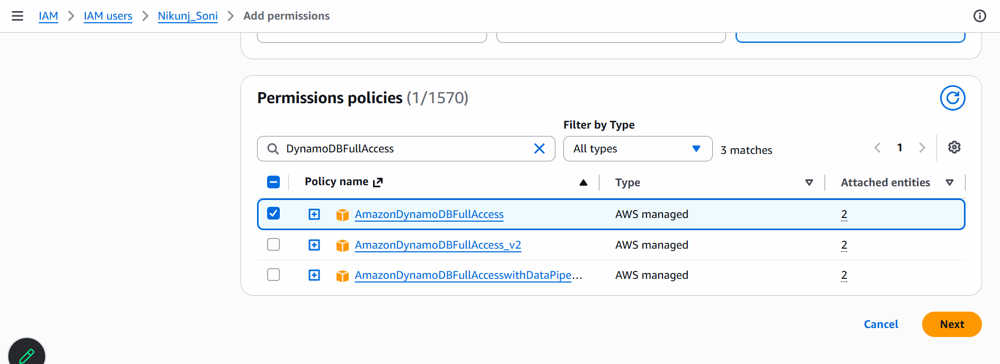

# DynamoDB
- it is AWS Database to Store the Values in Table Form Similar to MySQL
## Give Your User a Permission

- Create Table Using AWS CLI
```
aws dynamodb create-table \
  --table-name Employees \
  --attribute-definitions AttributeName=EmpID,AttributeType=S \
  --key-schema AttributeName=EmpID,KeyType=HASH \
  --billing-mode PAY_PER_REQUEST
```
## Insert Data
```
aws  dynamodb put-item \
--table-name Employees \
--item '{"EmpID":{"S":"E101"},"Name":{"S":"Nikunj Soni"}}'

```
```
aws  dynamodb put-item \
--table-name Employees \
--item '{"EmpID":{"S":"E102"},"Name":{"S":"Sarfarajkhan Bhatti"}}'
```
## Get The data
```
aws dynamodb scan --table-name Employees
```
## Delete item from Employees
```
aws dynamodb delete-item \
--table-name Employees \
--key '{"EmpID":{"S":"E101"}}'
```
## Delete Table Completely
```
aws dynamodb delete-table \
--table-name Employees
```