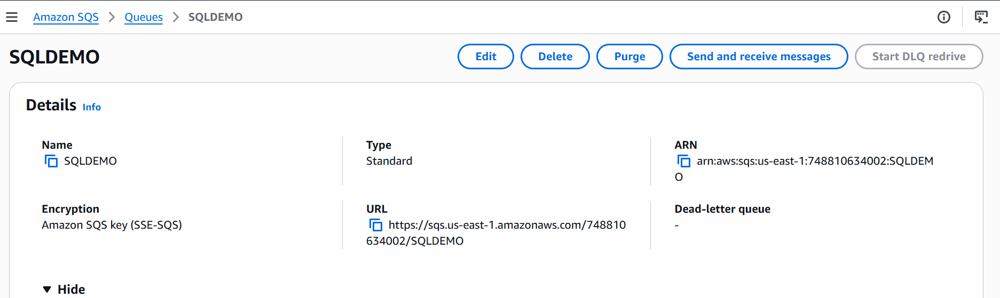

# SQS
- Simple Queue Service
- Suppose You Have End to End Applcation 
- When Multiple Request Coming To Your Application, it will not be able to hanlde
- let's say you app has tendency to handle 500 requests in a minute, and suppose 10000 requests came in a minute, so Your Application will Crash
- in this case we will use SQL from Amazon
````
Customer(Producer)
   |
   v
Python Order App
   |
   | "Pizza order #101"
   v
  SQS (Broker)
   |
   v
Python Worker(Dominos Server)
   |
   v
Process Order

````
## Create Simple Queue Service
```
AWS-->SQS-->Create QUEUE--> Standard--> Give The Name---> Create Queue
```
```
Copy the URL:
```

## Create Customer Application
Producer.py
```
import boto3
import json

sqs = boto3.client("sqs", region_name="us-east-1")

QUEUE_URL = "YOUR QUEUE URL"

order = {
    "order_id": 101,
    "customer": "Nikunj",
    "product": "Pizza",
    "quantity": 2
}

response = sqs.send_message(
    QueueUrl=QUEUE_URL,
    MessageBody=json.dumps(order)
)

print("Order sent successfully!")
print(response["MessageId"])

```

## Create Worker Application
worker.py
```

import boto3
import json
import time

sqs = boto3.client("sqs", region_name="us-east-1")

QUEUE_URL = "YOUR SQL URL"

print("Worker started...")

while True:

    response = sqs.receive_message(
        QueueUrl=QUEUE_URL,
        MaxNumberOfMessages=1,
        WaitTimeSeconds=10
    )

    messages = response.get("Messages", [])

    if not messages:
        print("No messages...")
        continue

    for message in messages:

        order = json.loads(message["Body"])

        print("Order received!")
        print("Order ID:", order["order_id"])
        print("Customer:", order["customer"])
        print("Product:", order["product"])
        print("Quantity:", order["quantity"])

        print("Processing order...")

        time.sleep(3)

        print("Order processed successfully!")

        sqs.delete_message(
            QueueUrl=QUEUE_URL,
            ReceiptHandle=message["ReceiptHandle"]
        )

        print("Message deleted from SQS")
```

## Run The Application
Create Order
```
python3 producer.py
```
output:
```
rder sent successfully!
80284d6e-d2ba-4775-9d61-9567e106b976
```
Receive the Order From SQL
```
python3 worker.py
```
- output
```
Worker started...
Order received!
Order ID: 101
Customer: Nikunj
Product: Pizza
Quantity: 2
Processing order...
Order processed successfully!
Message deleted from SQS
Order received!
Order ID: 12345
```